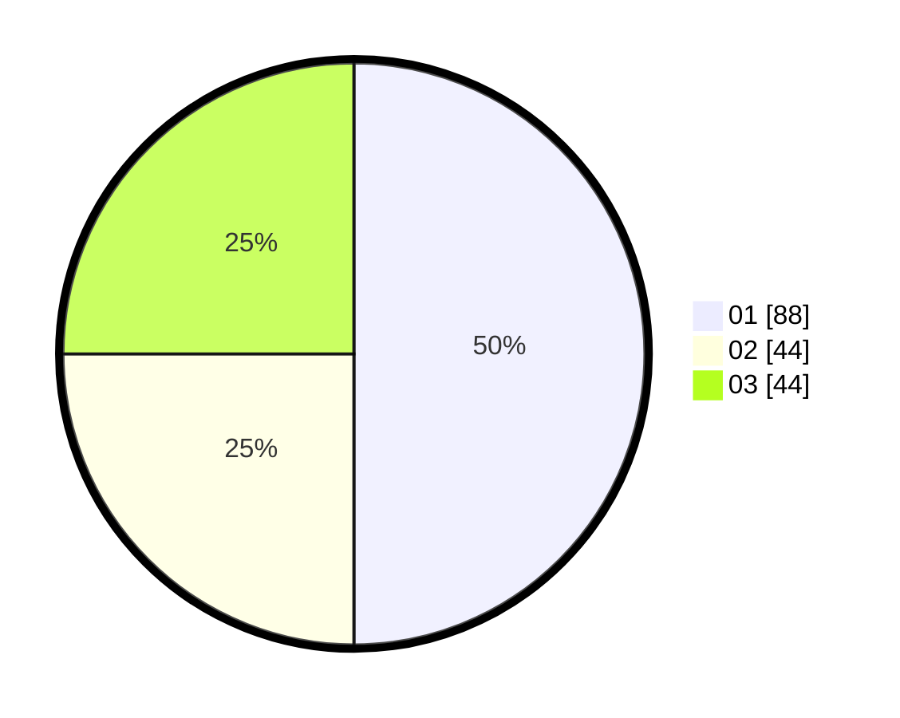

# Hasil

Hasil perolehan suara paslon dapat dilihat pada file paslon-01.txt, paslon-02.txt, dan paslon-03.txt.

Jika tidak ada, artinya data tersebut belum ada pada SIREKAP.

## Perolehan Suara

 * Paslon 01: **88**.
 * Paslon 02: **44**.
 * Paslon 03: **44**.

## Foto C Plano

https://sirekap-obj-formc.kpu.go.id/4b0c/pemilu/ppwp/31/73/03/10/06/3173031006056-20240214-155722--cad23e10-5619-4134-8c1b-40b2cdba463f.jpg

https://sirekap-obj-formc.kpu.go.id/4b0c/pemilu/ppwp/31/73/03/10/06/3173031006056-20240214-155725--c9878b0f-f162-4935-b6be-9ee33e5c8ca0.jpg

https://sirekap-obj-formc.kpu.go.id/4b0c/pemilu/ppwp/31/73/03/10/06/3173031006056-20240214-155511--c21f5f30-c0b7-410e-86fd-ec1f7de5c092.jpg
