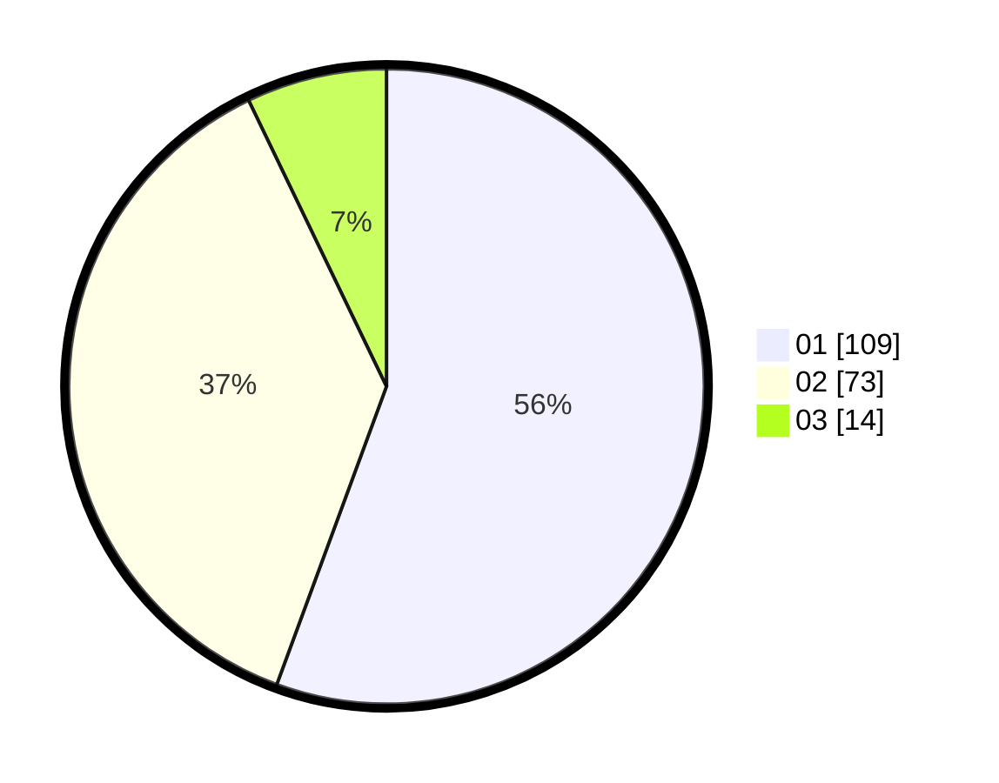

# Hasil

Hasil perolehan suara paslon dapat dilihat pada file paslon-01.txt, paslon-02.txt, dan paslon-03.txt.

Jika tidak ada, artinya data tersebut belum ada pada SIREKAP.

## Perolehan Suara

 * Paslon 01: **109**.
 * Paslon 02: **73**.
 * Paslon 03: **14**.

## Foto C Plano

https://sirekap-obj-formc.kpu.go.id/d179/pemilu/ppwp/31/73/03/10/06/3173031006057-20240214-233945--af979ee0-8c36-430b-a533-ee5f27927a1b.jpg

https://sirekap-obj-formc.kpu.go.id/d179/pemilu/ppwp/31/73/03/10/06/3173031006057-20240214-234026--1fc77931-99a6-422d-a274-d058e73dc376.jpg

https://sirekap-obj-formc.kpu.go.id/d179/pemilu/ppwp/31/73/03/10/06/3173031006057-20240214-234055--173e1d76-8fcb-48cf-a55e-cfbbda057384.jpg
