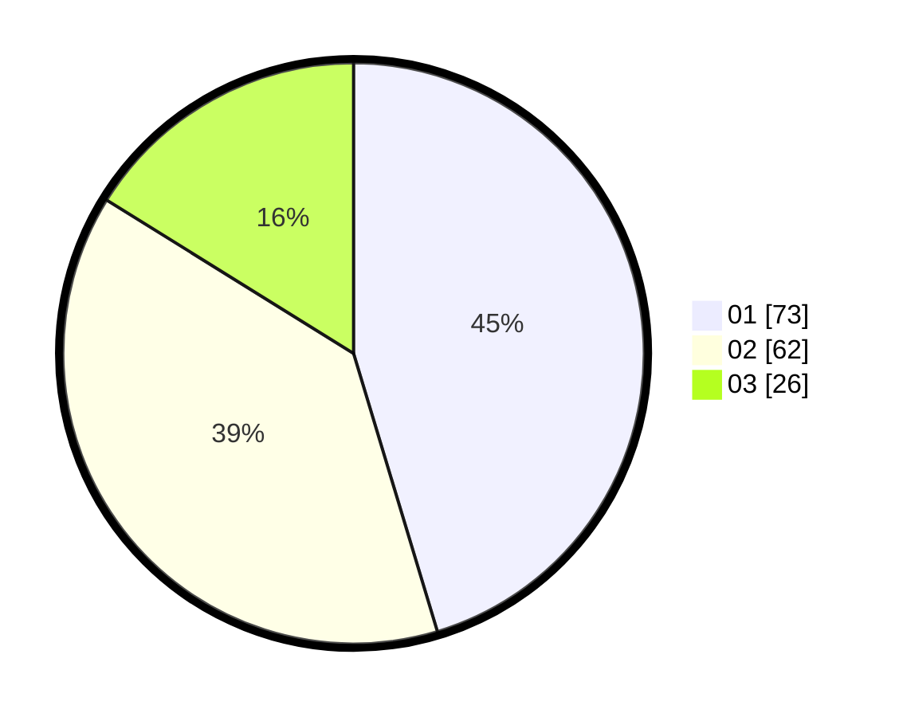

# Hasil

Hasil perolehan suara paslon dapat dilihat pada file paslon-01.txt, paslon-02.txt, dan paslon-03.txt.

Jika tidak ada, artinya data tersebut belum ada pada SIREKAP.

## Perolehan Suara

 * Paslon 01: **73**.
 * Paslon 02: **62**.
 * Paslon 03: **26**.

## Foto C Plano

https://sirekap-obj-formc.kpu.go.id/efee/pemilu/ppwp/31/73/03/10/06/3173031006058-20240214-213404--79d4c54a-bd68-48a4-8858-c1cd77ef3cb3.jpg

https://sirekap-obj-formc.kpu.go.id/efee/pemilu/ppwp/31/73/03/10/06/3173031006058-20240214-215656--33bd76f1-3ff4-4ccd-bf22-ae4762dcc73d.jpg

https://sirekap-obj-formc.kpu.go.id/efee/pemilu/ppwp/31/73/03/10/06/3173031006058-20240214-215805--b5613bb7-2001-4d62-b7b8-44bf8cb064d6.jpg
