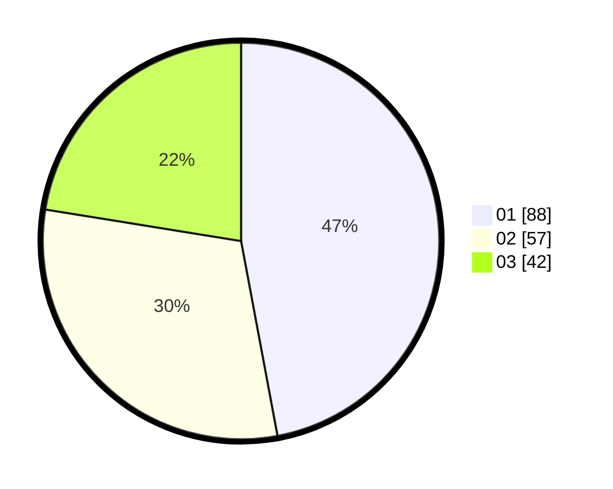

# Hasil

Hasil perolehan suara paslon dapat dilihat pada file paslon-01.txt, paslon-02.txt, dan paslon-03.txt.

Jika tidak ada, artinya data tersebut belum ada pada SIREKAP.

## Perolehan Suara

 * Paslon 01: **88**.
 * Paslon 02: **57**.
 * Paslon 03: **42**.

## Foto C Plano

https://sirekap-obj-formc.kpu.go.id/fd57/pemilu/ppwp/31/73/03/10/06/3173031006059-20240214-201109--125fe779-86e5-401b-95e4-3a55f3525792.jpg

https://sirekap-obj-formc.kpu.go.id/fd57/pemilu/ppwp/31/73/03/10/06/3173031006059-20240214-200025--a2927313-1505-40b0-b8b9-052b4a5f336a.jpg
