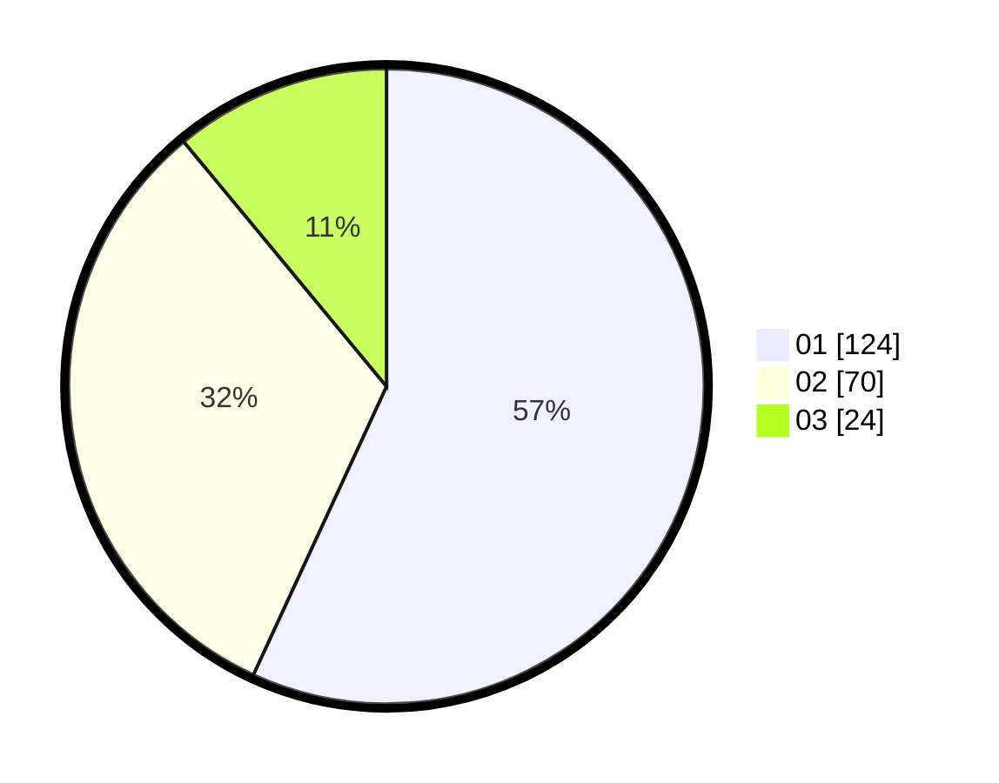

# Hasil

Hasil perolehan suara paslon dapat dilihat pada file paslon-01.txt, paslon-02.txt, dan paslon-03.txt.

Jika tidak ada, artinya data tersebut belum ada pada SIREKAP.

## Perolehan Suara

 * Paslon 01: **124**.
 * Paslon 02: **70**.
 * Paslon 03: **24**.

## Foto C Plano

https://sirekap-obj-formc.kpu.go.id/a64d/pemilu/ppwp/31/73/03/10/06/3173031006060-20240215-003125--c0bf5b01-e7f5-4f1f-9764-5b661aef986e.jpg

https://sirekap-obj-formc.kpu.go.id/a64d/pemilu/ppwp/31/73/03/10/06/3173031006060-20240215-031635--35d9b876-6891-459b-8ddf-e1db6b603a92.jpg

https://sirekap-obj-formc.kpu.go.id/a64d/pemilu/ppwp/31/73/03/10/06/3173031006060-20240215-031530--b7453def-22d1-41dd-ac34-98dd7faa5e7d.jpg
