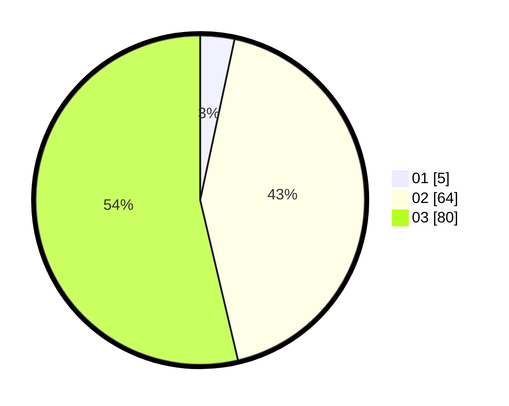

# Hasil

Hasil perolehan suara paslon dapat dilihat pada file paslon-01.txt, paslon-02.txt, dan paslon-03.txt.

Jika tidak ada, artinya data tersebut belum ada pada SIREKAP.

## Perolehan Suara

 * Paslon 01: **5**.
 * Paslon 02: **64**.
 * Paslon 03: **80**.

## Foto C Plano

https://sirekap-obj-formc.kpu.go.id/5783/pemilu/ppwp/31/73/03/10/07/3173031007001-20240214-191744--bbd0ca71-5d0d-40e2-94a0-abe7296c12a2.jpg

https://sirekap-obj-formc.kpu.go.id/5783/pemilu/ppwp/31/73/03/10/07/3173031007001-20240214-191755--7a58601d-02fe-4c71-b956-34ffe673dd6c.jpg

https://sirekap-obj-formc.kpu.go.id/5783/pemilu/ppwp/31/73/03/10/07/3173031007001-20240214-191803--5cb77352-fa91-4e19-9bf4-45b3a7a28a9f.jpg

## DATA PEMILIH TETAP

Jumlah pemilih dalam DPT: **199**.
 * L: **96**.
 * P: **103**.

## DATA PENGGUNA HAK PILIH

Jumlah pengguna hak pilih dalam DPT: **145**.
 * L: **72**.
 * P: **73**.

Jumlah pengguna hak pilih dalam DPTb: **4**.
 * L: **1**.
 * P: **3**.

Jumlah pengguna hak pilih dalam DPK: **1**.
 * L: **0**.
 * P: **1**.

Jumlah pengguna hak pilih: **150**.
 * L: **73**.
 * P: **77**.

## JUMLAH SUARA SAH DAN TIDAK SAH

JUMLAH SELURUH SUARA SAH: **149**.

JUMLAH SUARA TIDAK SAH: **1**.

JUMLAH SELURUH SUARA SAH DAN SUARA TIDAK SAH: **150**.
