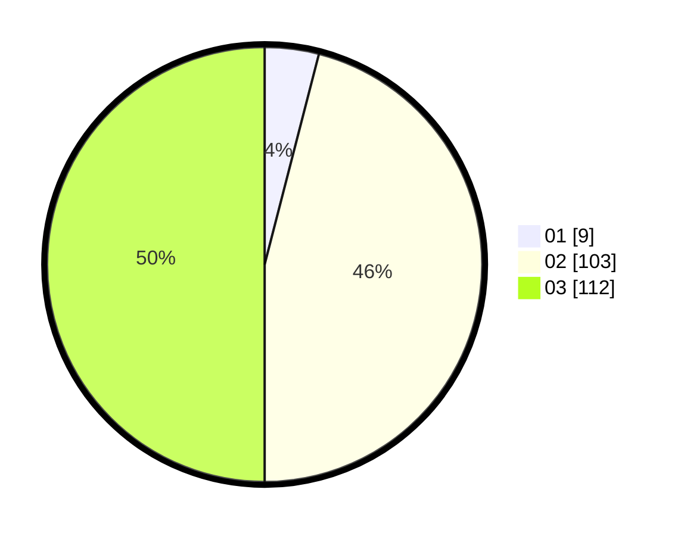

# Hasil

Hasil perolehan suara paslon dapat dilihat pada file paslon-01.txt, paslon-02.txt, dan paslon-03.txt.

Jika tidak ada, artinya data tersebut belum ada pada SIREKAP.

## Perolehan Suara

 * Paslon 01: **9**.
 * Paslon 02: **103**.
 * Paslon 03: **112**.

## Foto C Plano

https://sirekap-obj-formc.kpu.go.id/4a3a/pemilu/ppwp/31/73/03/10/07/3173031007003-20240214-204704--5d710308-9412-4791-8a0d-2ef6ec23e31c.jpg

https://sirekap-obj-formc.kpu.go.id/4a3a/pemilu/ppwp/31/73/03/10/07/3173031007003-20240214-204753--70237a66-9753-41bf-8577-7a9626732f08.jpg

https://sirekap-obj-formc.kpu.go.id/4a3a/pemilu/ppwp/31/73/03/10/07/3173031007003-20240214-204852--1ef6cd4c-02ef-4b12-8237-68d17ba58c51.jpg
