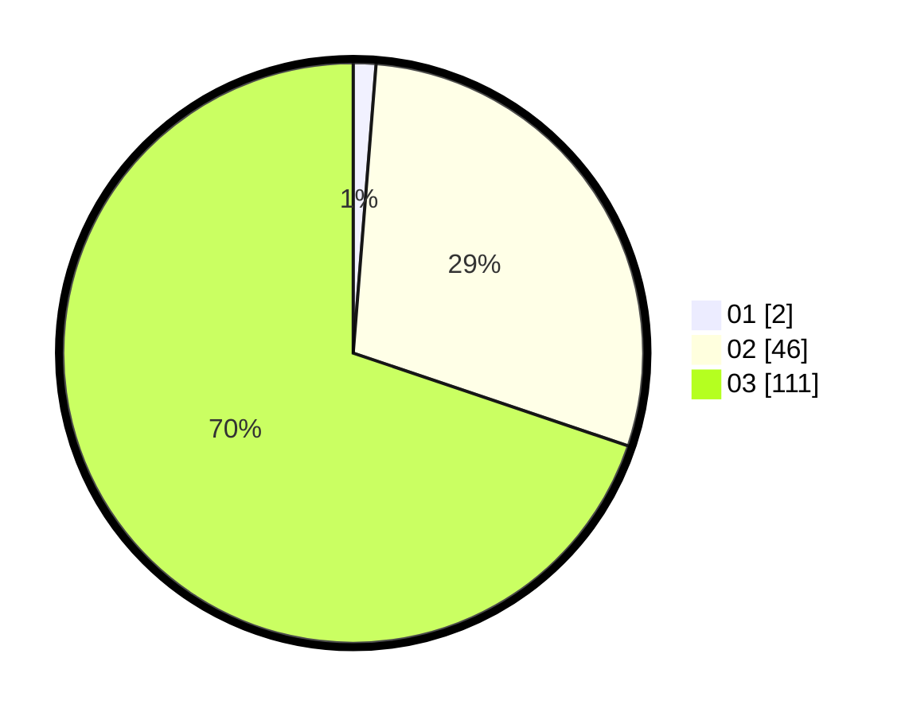

# Hasil

Hasil perolehan suara paslon dapat dilihat pada file paslon-01.txt, paslon-02.txt, dan paslon-03.txt.

Jika tidak ada, artinya data tersebut belum ada pada SIREKAP.

## Perolehan Suara

 * Paslon 01: **2**.
 * Paslon 02: **46**.
 * Paslon 03: **111**.

## Foto C Plano

https://sirekap-obj-formc.kpu.go.id/1184/pemilu/ppwp/31/73/03/10/07/3173031007005-20240214-155356--14587ba6-0c18-4336-b938-2147f437c427.jpg

https://sirekap-obj-formc.kpu.go.id/1184/pemilu/ppwp/31/73/03/10/07/3173031007005-20240214-155508--fc1125f4-6100-4a19-8633-cae1edab06e6.jpg

https://sirekap-obj-formc.kpu.go.id/1184/pemilu/ppwp/31/73/03/10/07/3173031007005-20240214-155428--840960cc-1e9f-4e52-b417-6b9d6ab75856.jpg
