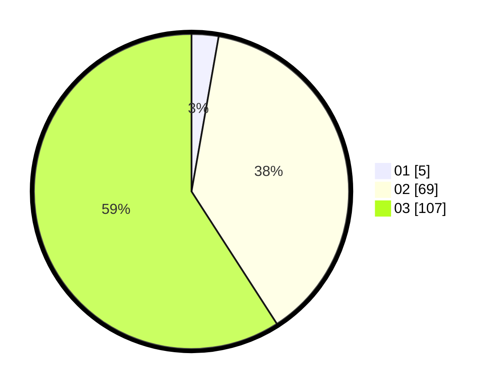

# Hasil

Hasil perolehan suara paslon dapat dilihat pada file paslon-01.txt, paslon-02.txt, dan paslon-03.txt.

Jika tidak ada, artinya data tersebut belum ada pada SIREKAP.

## Perolehan Suara

 * Paslon 01: **5**.
 * Paslon 02: **69**.
 * Paslon 03: **107**.

## Foto C Plano

https://sirekap-obj-formc.kpu.go.id/aa87/pemilu/ppwp/31/73/03/10/07/3173031007008-20240214-201332--f27611db-0f57-4e1b-8399-b089aecf11dd.jpg

https://sirekap-obj-formc.kpu.go.id/aa87/pemilu/ppwp/31/73/03/10/07/3173031007008-20240214-213900--c9828f05-d143-4dae-8c04-565f07cae6a5.jpg

https://sirekap-obj-formc.kpu.go.id/aa87/pemilu/ppwp/31/73/03/10/07/3173031007008-20240214-201659--92936773-cab4-443a-a718-1a8f11cb3f6c.jpg

## DATA PEMILIH TETAP

Jumlah pemilih dalam DPT: **257**.
 * L: **122**.
 * P: **135**.

## DATA PENGGUNA HAK PILIH

Jumlah pengguna hak pilih dalam DPT: **187**.
 * L: **90**.
 * P: **97**.

Jumlah pengguna hak pilih dalam DPTb: **13**.
 * L: **5**.
 * P: **8**.

Jumlah pengguna hak pilih dalam DPK: **0**.
 * L: **0**.
 * P: **0**.

Jumlah pengguna hak pilih: **200**.
 * L: **95**.
 * P: **105**.

## JUMLAH SUARA SAH DAN TIDAK SAH

JUMLAH SELURUH SUARA SAH: **181**.

JUMLAH SUARA TIDAK SAH: **19**.

JUMLAH SELURUH SUARA SAH DAN SUARA TIDAK SAH: **200**.
