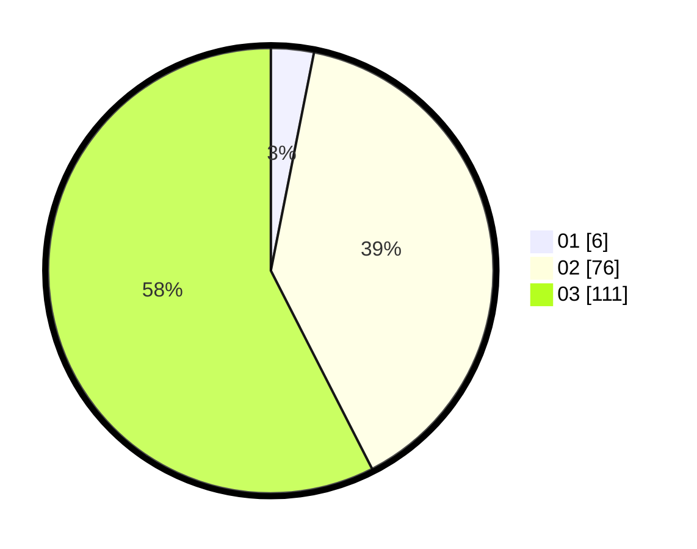

# Hasil

Hasil perolehan suara paslon dapat dilihat pada file paslon-01.txt, paslon-02.txt, dan paslon-03.txt.

Jika tidak ada, artinya data tersebut belum ada pada SIREKAP.

## Perolehan Suara

 * Paslon 01: **6**.
 * Paslon 02: **76**.
 * Paslon 03: **111**.

## Foto C Plano

https://sirekap-obj-formc.kpu.go.id/02c9/pemilu/ppwp/31/73/03/10/07/3173031007009-20240214-222303--fc3dca76-c915-497e-9ce5-df9fb41a24bc.jpg

https://sirekap-obj-formc.kpu.go.id/02c9/pemilu/ppwp/31/73/03/10/07/3173031007009-20240214-221917--6899f94a-c998-461f-bffe-2c8b35a8fa6f.jpg

https://sirekap-obj-formc.kpu.go.id/02c9/pemilu/ppwp/31/73/03/10/07/3173031007009-20240214-222546--78e6a7b8-01d9-454c-8434-764eba5cf85d.jpg
