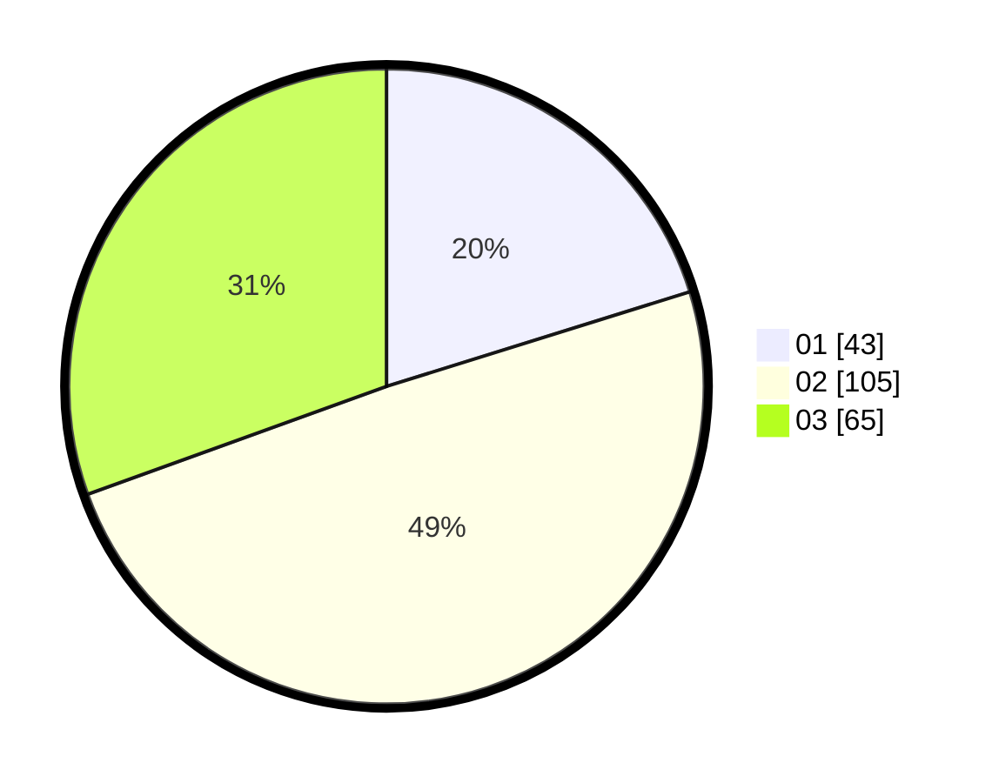

# Hasil

Hasil perolehan suara paslon dapat dilihat pada file paslon-01.txt, paslon-02.txt, dan paslon-03.txt.

Jika tidak ada, artinya data tersebut belum ada pada SIREKAP.

## Perolehan Suara

 * Paslon 01: **43**.
 * Paslon 02: **105**.
 * Paslon 03: **65**.

## Foto C Plano

https://sirekap-obj-formc.kpu.go.id/d4cd/pemilu/ppwp/31/73/03/10/07/3173031007013-20240214-220007--94ce1d15-20b2-4206-b9f6-018653c4c903.jpg

https://sirekap-obj-formc.kpu.go.id/d4cd/pemilu/ppwp/31/73/03/10/07/3173031007013-20240214-204056--42ef62da-4598-4eae-a733-844e03bed78e.jpg

https://sirekap-obj-formc.kpu.go.id/d4cd/pemilu/ppwp/31/73/03/10/07/3173031007013-20240214-204227--9321bfac-8e77-4ffd-a84d-68ba2f5f2a2e.jpg
