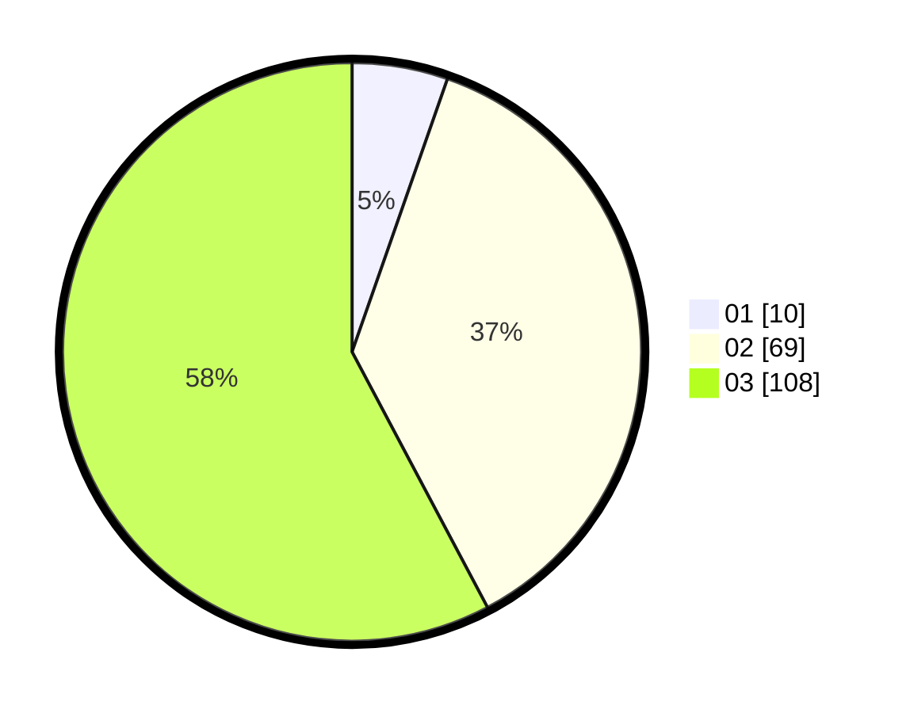

# Hasil

Hasil perolehan suara paslon dapat dilihat pada file paslon-01.txt, paslon-02.txt, dan paslon-03.txt.

Jika tidak ada, artinya data tersebut belum ada pada SIREKAP.

## Perolehan Suara

 * Paslon 01: **10**.
 * Paslon 02: **69**.
 * Paslon 03: **108**.

## Foto C Plano

https://sirekap-obj-formc.kpu.go.id/b262/pemilu/ppwp/31/73/03/10/07/3173031007016-20240214-210901--67df6d12-8906-40e0-9b1b-7db1962a0fdd.jpg

https://sirekap-obj-formc.kpu.go.id/b262/pemilu/ppwp/31/73/03/10/07/3173031007016-20240214-210804--08cbb6a1-58f9-46ea-b217-648a590be966.jpg

https://sirekap-obj-formc.kpu.go.id/b262/pemilu/ppwp/31/73/03/10/07/3173031007016-20240214-191731--bd788b41-6961-425d-8552-5d17e9a9e82a.jpg
