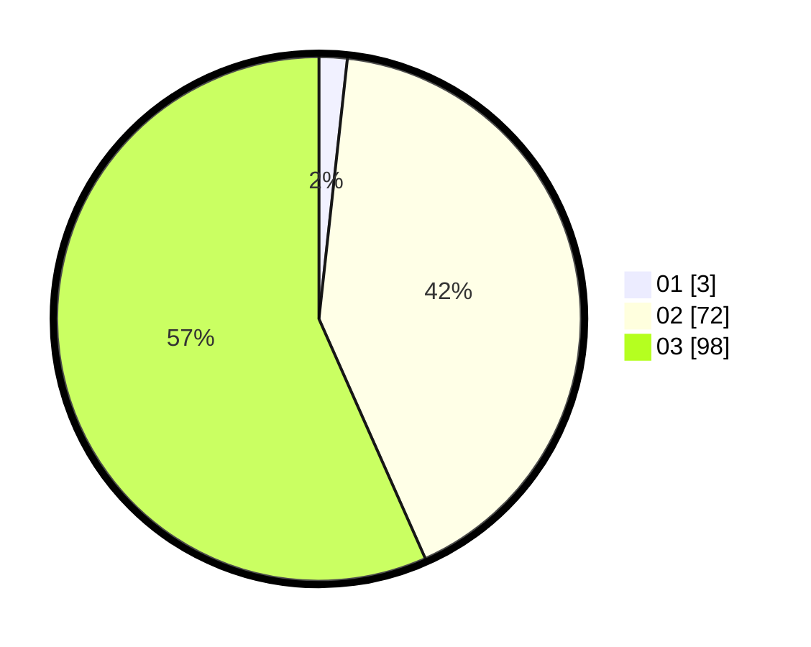

# Hasil

Hasil perolehan suara paslon dapat dilihat pada file paslon-01.txt, paslon-02.txt, dan paslon-03.txt.

Jika tidak ada, artinya data tersebut belum ada pada SIREKAP.

## Perolehan Suara

 * Paslon 01: **3**.
 * Paslon 02: **72**.
 * Paslon 03: **98**.

## Foto C Plano

https://sirekap-obj-formc.kpu.go.id/d74d/pemilu/ppwp/31/73/03/10/07/3173031007017-20240214-191912--598f8d80-28cd-424d-83f4-770cd31a45a5.jpg

https://sirekap-obj-formc.kpu.go.id/d74d/pemilu/ppwp/31/73/03/10/07/3173031007017-20240214-191717--cdc72c32-b88b-429e-8efc-20ba3a788be2.jpg

https://sirekap-obj-formc.kpu.go.id/d74d/pemilu/ppwp/31/73/03/10/07/3173031007017-20240214-191615--7b04fa1d-8446-4683-a006-0b289829263f.jpg
