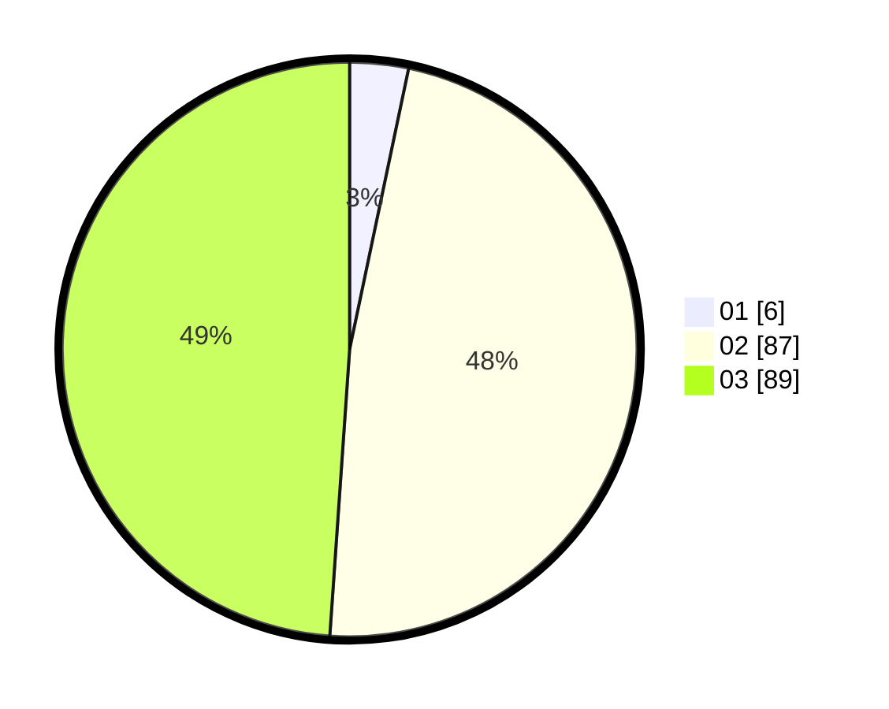

# Hasil

Hasil perolehan suara paslon dapat dilihat pada file paslon-01.txt, paslon-02.txt, dan paslon-03.txt.

Jika tidak ada, artinya data tersebut belum ada pada SIREKAP.

## Perolehan Suara

 * Paslon 01: **6**.
 * Paslon 02: **87**.
 * Paslon 03: **89**.

## Foto C Plano

https://sirekap-obj-formc.kpu.go.id/bf09/pemilu/ppwp/31/73/03/10/07/3173031007021-20240214-231441--d941054e-9169-4537-b578-aa146468d9fc.jpg

https://sirekap-obj-formc.kpu.go.id/bf09/pemilu/ppwp/31/73/03/10/07/3173031007021-20240214-231602--6b14da38-8402-4d96-a7b1-13ac80ac11bf.jpg

https://sirekap-obj-formc.kpu.go.id/bf09/pemilu/ppwp/31/73/03/10/07/3173031007021-20240214-231652--a8088584-cdc5-483a-852e-0cd1f4fc7bc4.jpg
