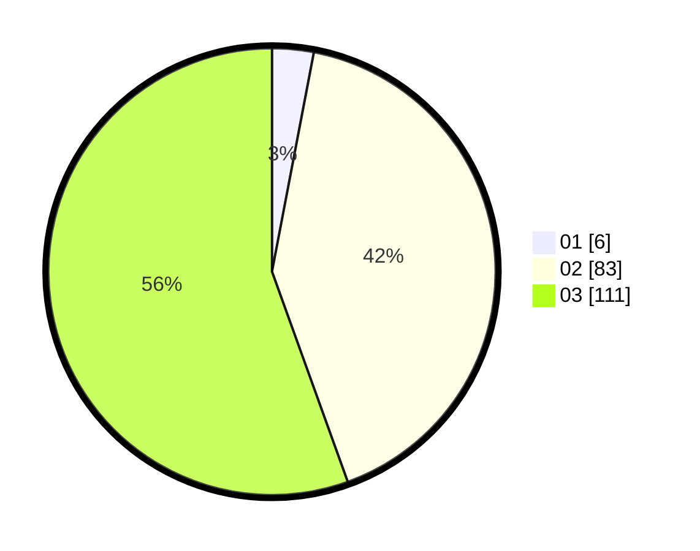

# Hasil

Hasil perolehan suara paslon dapat dilihat pada file paslon-01.txt, paslon-02.txt, dan paslon-03.txt.

Jika tidak ada, artinya data tersebut belum ada pada SIREKAP.

## Perolehan Suara

 * Paslon 01: **6**.
 * Paslon 02: **83**.
 * Paslon 03: **111**.

## Foto C Plano

https://sirekap-obj-formc.kpu.go.id/5954/pemilu/ppwp/31/73/03/10/07/3173031007023-20240214-195304--b7a28cd1-956f-48d1-b5a0-14a2edf5ba59.jpg

https://sirekap-obj-formc.kpu.go.id/5954/pemilu/ppwp/31/73/03/10/07/3173031007023-20240214-220335--8d87aa5c-4cdf-4f07-891e-15664750676d.jpg

https://sirekap-obj-formc.kpu.go.id/5954/pemilu/ppwp/31/73/03/10/07/3173031007023-20240214-220423--0c6478e8-189d-4617-bff3-dec0211473bc.jpg

## DATA PEMILIH TETAP

Jumlah pemilih dalam DPT: **259**.
 * L: **120**.
 * P: **139**.

## DATA PENGGUNA HAK PILIH

Jumlah pengguna hak pilih dalam DPT: **188**.
 * L: **83**.
 * P: **105**.

Jumlah pengguna hak pilih dalam DPTb: **7**.
 * L: **2**.
 * P: **5**.

Jumlah pengguna hak pilih dalam DPK: **7**.
 * L: **2**.
 * P: **5**.

Jumlah pengguna hak pilih: **202**.
 * L: **87**.
 * P: **115**.

## JUMLAH SUARA SAH DAN TIDAK SAH

JUMLAH SELURUH SUARA SAH: **200**.

JUMLAH SUARA TIDAK SAH: **2**.

JUMLAH SELURUH SUARA SAH DAN SUARA TIDAK SAH: **202**.
