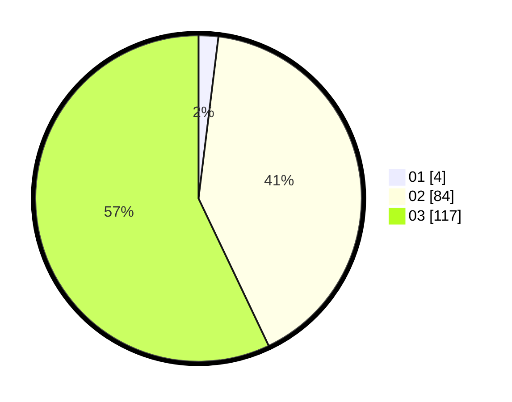

# Hasil

Hasil perolehan suara paslon dapat dilihat pada file paslon-01.txt, paslon-02.txt, dan paslon-03.txt.

Jika tidak ada, artinya data tersebut belum ada pada SIREKAP.

## Perolehan Suara

 * Paslon 01: **4**.
 * Paslon 02: **84**.
 * Paslon 03: **117**.

## Foto C Plano

https://sirekap-obj-formc.kpu.go.id/9c3b/pemilu/ppwp/31/73/03/10/07/3173031007027-20240214-205914--6dacc16c-d4e6-4aaa-bcaa-20c2631da1ef.jpg

https://sirekap-obj-formc.kpu.go.id/9c3b/pemilu/ppwp/31/73/03/10/07/3173031007027-20240214-205940--9e01e942-b0e1-43af-87e2-10e32aa45221.jpg

https://sirekap-obj-formc.kpu.go.id/9c3b/pemilu/ppwp/31/73/03/10/07/3173031007027-20240214-210011--dc9a28d6-3482-469c-a810-9dfba51db112.jpg
