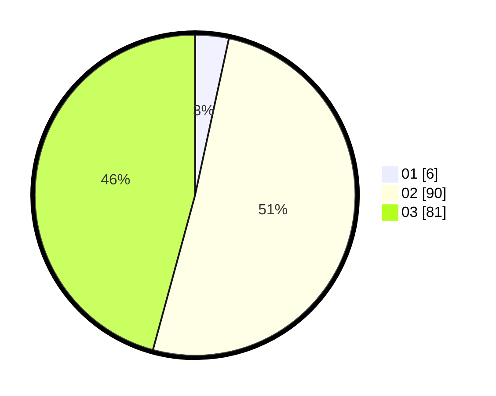

# Hasil

Hasil perolehan suara paslon dapat dilihat pada file paslon-01.txt, paslon-02.txt, dan paslon-03.txt.

Jika tidak ada, artinya data tersebut belum ada pada SIREKAP.

## Perolehan Suara

 * Paslon 01: **6**.
 * Paslon 02: **90**.
 * Paslon 03: **81**.

## Foto C Plano

https://sirekap-obj-formc.kpu.go.id/61f6/pemilu/ppwp/31/73/03/10/08/3173031008008-20240214-212610--810b1c27-c5a8-49b0-9020-bcf6ac9cce6d.jpg

https://sirekap-obj-formc.kpu.go.id/61f6/pemilu/ppwp/31/73/03/10/08/3173031008008-20240214-212645--30d8c709-6195-4a05-bbd4-8dad2cd68bbd.jpg

https://sirekap-obj-formc.kpu.go.id/61f6/pemilu/ppwp/31/73/03/10/08/3173031008008-20240214-205907--51f716d4-95d7-451c-af6c-869a98ce33eb.jpg
