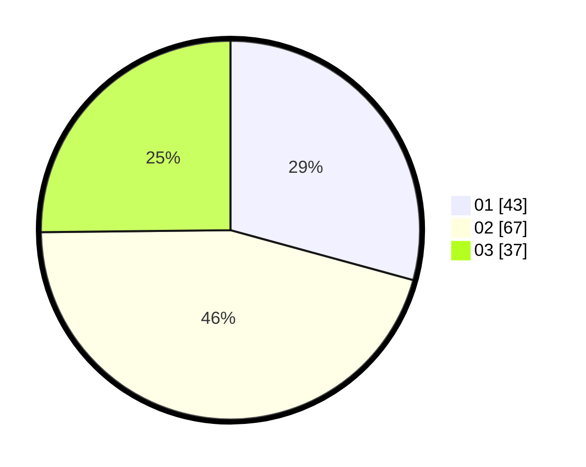

# Hasil

Hasil perolehan suara paslon dapat dilihat pada file paslon-01.txt, paslon-02.txt, dan paslon-03.txt.

Jika tidak ada, artinya data tersebut belum ada pada SIREKAP.

## Perolehan Suara

 * Paslon 01: **43**.
 * Paslon 02: **67**.
 * Paslon 03: **37**.

## Foto C Plano

https://sirekap-obj-formc.kpu.go.id/a615/pemilu/ppwp/31/73/03/10/08/3173031008012-20240214-225355--21cbed5e-3450-4b88-a463-fee7d22c6dd5.jpg

https://sirekap-obj-formc.kpu.go.id/a615/pemilu/ppwp/31/73/03/10/08/3173031008012-20240214-225619--74c09f0e-906b-4ac6-8b88-9f7ddb97fb56.jpg

https://sirekap-obj-formc.kpu.go.id/a615/pemilu/ppwp/31/73/03/10/08/3173031008012-20240214-225837--db2d53f2-41a4-4f8a-8904-9118354a88e0.jpg
