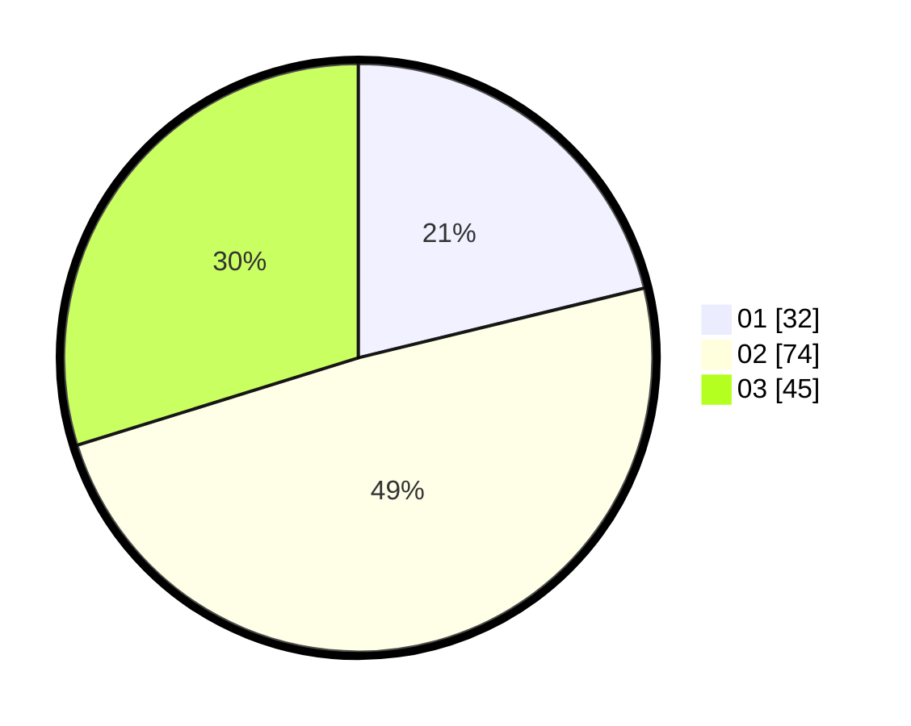

# Hasil

Hasil perolehan suara paslon dapat dilihat pada file paslon-01.txt, paslon-02.txt, dan paslon-03.txt.

Jika tidak ada, artinya data tersebut belum ada pada SIREKAP.

## Perolehan Suara

 * Paslon 01: **32**.
 * Paslon 02: **74**.
 * Paslon 03: **45**.

## Foto C Plano

https://sirekap-obj-formc.kpu.go.id/73b9/pemilu/ppwp/31/73/03/10/08/3173031008015-20240214-184702--271884fe-9e2f-44c1-9946-b4e28785ba01.jpg

https://sirekap-obj-formc.kpu.go.id/73b9/pemilu/ppwp/31/73/03/10/08/3173031008015-20240214-190602--40369f78-4044-4a0d-9334-c178f86de3cc.jpg

https://sirekap-obj-formc.kpu.go.id/73b9/pemilu/ppwp/31/73/03/10/08/3173031008015-20240214-185121--fbdc3a7d-2947-46ba-a041-0bbf8324f3ab.jpg

## DATA PEMILIH TETAP

Jumlah pemilih dalam DPT: **203**.
 * L: **102**.
 * P: **101**.

## DATA PENGGUNA HAK PILIH

Jumlah pengguna hak pilih dalam DPT: **152**.
 * L: **74**.
 * P: **78**.

Jumlah pengguna hak pilih dalam DPTb: **0**.
 * L: **0**.
 * P: **0**.

Jumlah pengguna hak pilih dalam DPK: **1**.
 * L: **1**.
 * P: **0**.

Jumlah pengguna hak pilih: **153**.
 * L: **75**.
 * P: **78**.

## JUMLAH SUARA SAH DAN TIDAK SAH

JUMLAH SELURUH SUARA SAH: **151**.

JUMLAH SUARA TIDAK SAH: **2**.

JUMLAH SELURUH SUARA SAH DAN SUARA TIDAK SAH: **153**.
