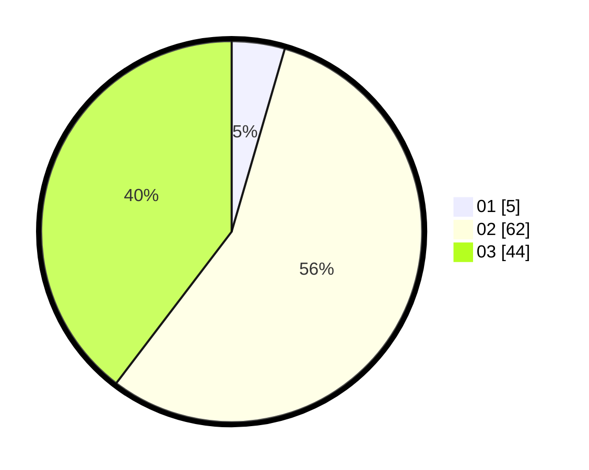

# Hasil

Hasil perolehan suara paslon dapat dilihat pada file paslon-01.txt, paslon-02.txt, dan paslon-03.txt.

Jika tidak ada, artinya data tersebut belum ada pada SIREKAP.

## Perolehan Suara

 * Paslon 01: **5**.
 * Paslon 02: **62**.
 * Paslon 03: **44**.

## Foto C Plano

https://sirekap-obj-formc.kpu.go.id/4a46/pemilu/ppwp/31/73/03/10/08/3173031008024-20240214-190220--5f62f22c-b4f7-49b0-9394-2263cfd6f15c.jpg

https://sirekap-obj-formc.kpu.go.id/4a46/pemilu/ppwp/31/73/03/10/08/3173031008024-20240214-191748--8f2d7630-980a-40aa-9071-42f5900905e8.jpg

https://sirekap-obj-formc.kpu.go.id/4a46/pemilu/ppwp/31/73/03/10/08/3173031008024-20240214-191358--4d7a00ee-63ed-46cf-8aaf-8e5788137a89.jpg

## DATA PEMILIH TETAP

Jumlah pemilih dalam DPT: **222**.
 * L: **103**.
 * P: **119**.

## DATA PENGGUNA HAK PILIH

Jumlah pengguna hak pilih dalam DPT: **156**.
 * L: **75**.
 * P: **81**.

Jumlah pengguna hak pilih dalam DPTb: **6**.
 * L: **6**.
 * P: **0**.

Jumlah pengguna hak pilih dalam DPK: **2**.
 * L: **1**.
 * P: **1**.

Jumlah pengguna hak pilih: **164**.
 * L: **82**.
 * P: **82**.

## JUMLAH SUARA SAH DAN TIDAK SAH

JUMLAH SELURUH SUARA SAH: **163**.

JUMLAH SUARA TIDAK SAH: **1**.

JUMLAH SELURUH SUARA SAH DAN SUARA TIDAK SAH: **164**.
