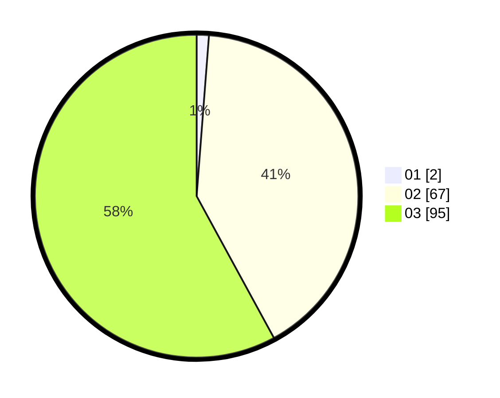

# Hasil

Hasil perolehan suara paslon dapat dilihat pada file paslon-01.txt, paslon-02.txt, dan paslon-03.txt.

Jika tidak ada, artinya data tersebut belum ada pada SIREKAP.

## Perolehan Suara

 * Paslon 01: **2**.
 * Paslon 02: **67**.
 * Paslon 03: **95**.

## Foto C Plano

https://sirekap-obj-formc.kpu.go.id/29a7/pemilu/ppwp/31/73/03/10/08/3173031008025-20240215-210354--ae592eb5-6dd6-45af-81fb-bcfb6b20e48d.jpg

https://sirekap-obj-formc.kpu.go.id/29a7/pemilu/ppwp/31/73/03/10/08/3173031008025-20240215-210356--dcfb904f-ce8b-4cc0-9828-9365ae5e3b5a.jpg

https://sirekap-obj-formc.kpu.go.id/29a7/pemilu/ppwp/31/73/03/10/08/3173031008025-20240215-210355--fd7c2884-17b7-4331-bf72-42dabe57e93f.jpg

## DATA PEMILIH TETAP

Jumlah pemilih dalam DPT: **228**.
 * L: **103**.
 * P: **125**.

## DATA PENGGUNA HAK PILIH

Jumlah pengguna hak pilih dalam DPT: **153**.
 * L: **68**.
 * P: **85**.

Jumlah pengguna hak pilih dalam DPTb: **9**.
 * L: **6**.
 * P: **3**.

Jumlah pengguna hak pilih dalam DPK: **3**.
 * L: **3**.
 * P: **0**.

Jumlah pengguna hak pilih: **165**.
 * L: **77**.
 * P: **88**.

## JUMLAH SUARA SAH DAN TIDAK SAH

JUMLAH SELURUH SUARA SAH: **164**.

JUMLAH SUARA TIDAK SAH: **1**.

JUMLAH SELURUH SUARA SAH DAN SUARA TIDAK SAH: **165**.
