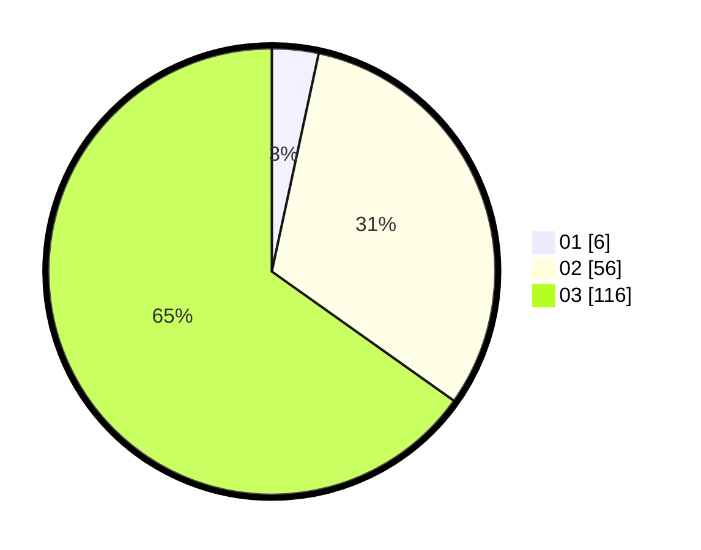

# Hasil

Hasil perolehan suara paslon dapat dilihat pada file paslon-01.txt, paslon-02.txt, dan paslon-03.txt.

Jika tidak ada, artinya data tersebut belum ada pada SIREKAP.

## Perolehan Suara

 * Paslon 01: **6**.
 * Paslon 02: **56**.
 * Paslon 03: **116**.

## Foto C Plano

https://sirekap-obj-formc.kpu.go.id/f42c/pemilu/ppwp/31/73/03/10/08/3173031008026-20240215-205942--9cc83333-64e2-42fd-b5db-abfb7d309a59.jpg

https://sirekap-obj-formc.kpu.go.id/f42c/pemilu/ppwp/31/73/03/10/08/3173031008026-20240215-205944--022d4d85-740b-4f4a-bbcf-cc528ac47b58.jpg

https://sirekap-obj-formc.kpu.go.id/f42c/pemilu/ppwp/31/73/03/10/08/3173031008026-20240215-205943--5f1e60e9-ab08-4684-ad38-a8284398930c.jpg

## DATA PEMILIH TETAP

Jumlah pemilih dalam DPT: **233**.
 * L: **103**.
 * P: **130**.

## DATA PENGGUNA HAK PILIH

Jumlah pengguna hak pilih dalam DPT: **167**.
 * L: **82**.
 * P: **85**.

Jumlah pengguna hak pilih dalam DPTb: **9**.
 * L: **6**.
 * P: **3**.

Jumlah pengguna hak pilih dalam DPK: **3**.
 * L: **1**.
 * P: **2**.

Jumlah pengguna hak pilih: **0**.
 * L: **0**.
 * P: **0**.

## JUMLAH SUARA SAH DAN TIDAK SAH

JUMLAH SELURUH SUARA SAH: **178**.

JUMLAH SUARA TIDAK SAH: **1**.

JUMLAH SELURUH SUARA SAH DAN SUARA TIDAK SAH: **179**.
