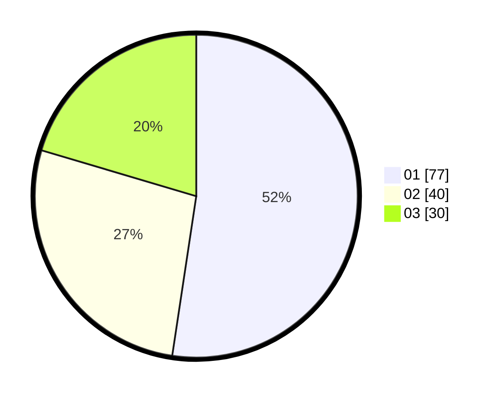

# Hasil

Hasil perolehan suara paslon dapat dilihat pada file paslon-01.txt, paslon-02.txt, dan paslon-03.txt.

Jika tidak ada, artinya data tersebut belum ada pada SIREKAP.

## Perolehan Suara

 * Paslon 01: **77**.
 * Paslon 02: **40**.
 * Paslon 03: **30**.

## Foto C Plano

https://sirekap-obj-formc.kpu.go.id/ec7f/pemilu/ppwp/31/73/03/10/08/3173031008028-20240214-194627--dcfe40ce-3a53-4378-aa76-367fc0ad5aef.jpg

https://sirekap-obj-formc.kpu.go.id/ec7f/pemilu/ppwp/31/73/03/10/08/3173031008028-20240214-195002--62461b67-f54b-4d55-a95e-a924d83e44c4.jpg

https://sirekap-obj-formc.kpu.go.id/ec7f/pemilu/ppwp/31/73/03/10/08/3173031008028-20240214-195223--9898c52b-6f8d-4cdf-84c3-7984a054855b.jpg
