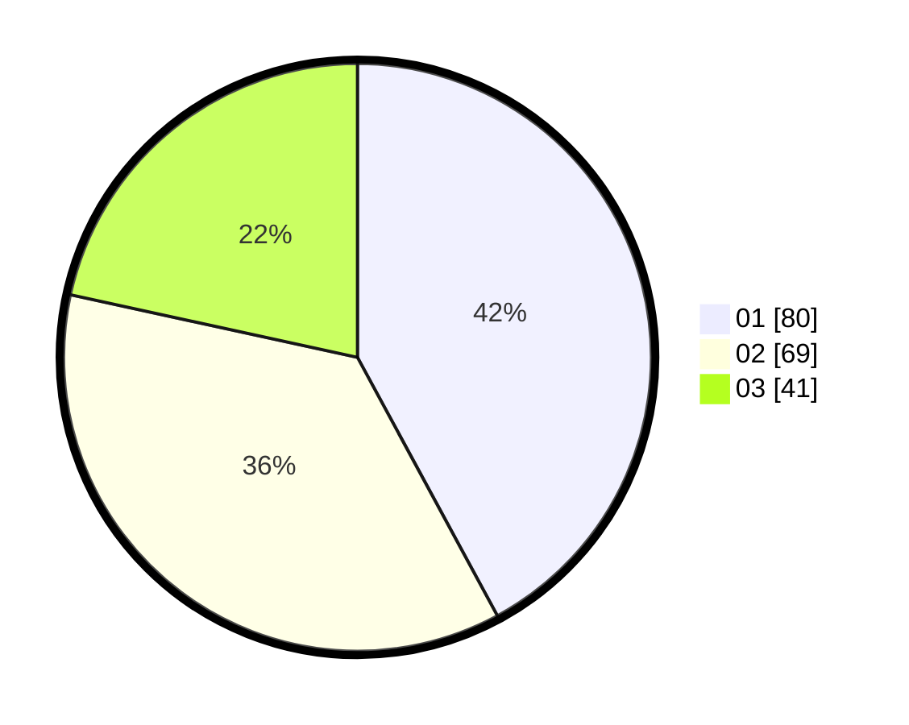

# Hasil

Hasil perolehan suara paslon dapat dilihat pada file paslon-01.txt, paslon-02.txt, dan paslon-03.txt.

Jika tidak ada, artinya data tersebut belum ada pada SIREKAP.

## Perolehan Suara

 * Paslon 01: **80**.
 * Paslon 02: **69**.
 * Paslon 03: **41**.

## Foto C Plano

https://sirekap-obj-formc.kpu.go.id/5d91/pemilu/ppwp/31/73/03/10/08/3173031008036-20240215-001508--339dc8a6-f4d3-45f9-a559-9a05e96c982f.jpg

https://sirekap-obj-formc.kpu.go.id/5d91/pemilu/ppwp/31/73/03/10/08/3173031008036-20240215-001516--ac8104d0-c25f-494a-b457-7922f0b5a3e2.jpg

https://sirekap-obj-formc.kpu.go.id/5d91/pemilu/ppwp/31/73/03/10/08/3173031008036-20240215-001730--b1c75d24-5a97-4f50-ba0e-86304483ba45.jpg
