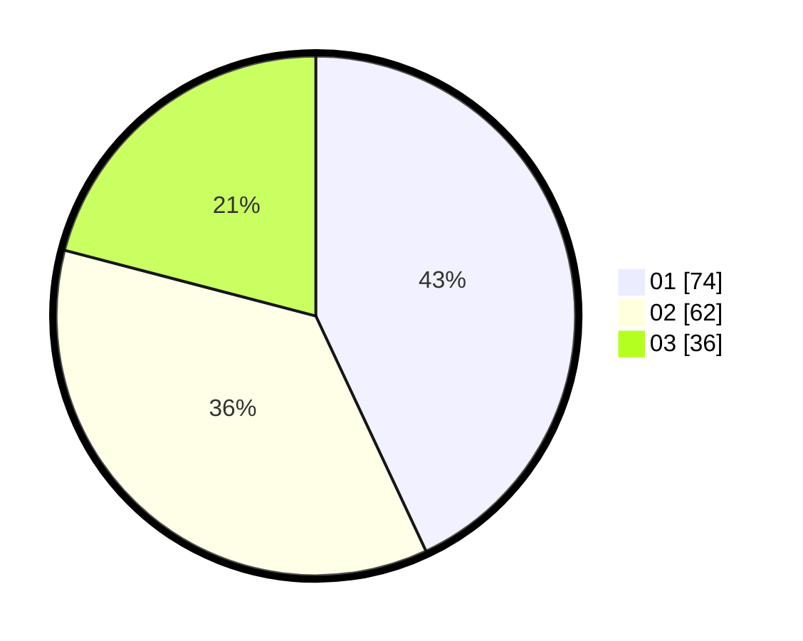

# Hasil

Hasil perolehan suara paslon dapat dilihat pada file paslon-01.txt, paslon-02.txt, dan paslon-03.txt.

Jika tidak ada, artinya data tersebut belum ada pada SIREKAP.

## Perolehan Suara

 * Paslon 01: **74**.
 * Paslon 02: **62**.
 * Paslon 03: **36**.

## Foto C Plano

https://sirekap-obj-formc.kpu.go.id/36c2/pemilu/ppwp/31/73/03/10/08/3173031008038-20240216-150328--4082a834-ef2d-4f6c-9d55-07c0e45314d6.jpg

https://sirekap-obj-formc.kpu.go.id/36c2/pemilu/ppwp/31/73/03/10/08/3173031008038-20240216-150330--0f11bf42-e35b-4143-83d1-a0fbe8c54e0f.jpg

https://sirekap-obj-formc.kpu.go.id/36c2/pemilu/ppwp/31/73/03/10/08/3173031008038-20240216-150329--56040ef9-40d9-4648-b2d8-90903a00b333.jpg

## DATA PEMILIH TETAP

Jumlah pemilih dalam DPT: **245**.
 * L: **128**.
 * P: **117**.

## DATA PENGGUNA HAK PILIH

Jumlah pengguna hak pilih dalam DPT: **175**.
 * L: **89**.
 * P: **86**.

Jumlah pengguna hak pilih dalam DPTb: **0**.
 * L: **0**.
 * P: **0**.

Jumlah pengguna hak pilih dalam DPK: **2**.
 * L: **1**.
 * P: **1**.

Jumlah pengguna hak pilih: **177**.
 * L: **90**.
 * P: **87**.

## JUMLAH SUARA SAH DAN TIDAK SAH

JUMLAH SELURUH SUARA SAH: **172**.

JUMLAH SUARA TIDAK SAH: **5**.

JUMLAH SELURUH SUARA SAH DAN SUARA TIDAK SAH: **177**.
