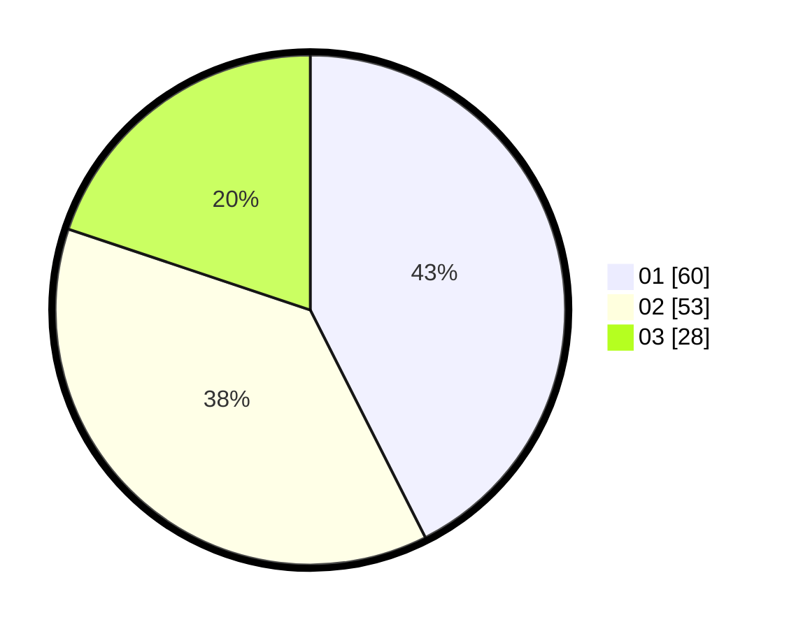

# Hasil

Hasil perolehan suara paslon dapat dilihat pada file paslon-01.txt, paslon-02.txt, dan paslon-03.txt.

Jika tidak ada, artinya data tersebut belum ada pada SIREKAP.

## Perolehan Suara

 * Paslon 01: **60**.
 * Paslon 02: **53**.
 * Paslon 03: **28**.

## Foto C Plano

https://sirekap-obj-formc.kpu.go.id/0e54/pemilu/ppwp/31/73/03/10/08/3173031008039-20240214-200937--b93ded2f-4cdf-4bab-8d3d-af8116bd0921.jpg

https://sirekap-obj-formc.kpu.go.id/0e54/pemilu/ppwp/31/73/03/10/08/3173031008039-20240214-200940--97d4d462-581d-41a4-8811-22a6b4dcc2a4.jpg

https://sirekap-obj-formc.kpu.go.id/0e54/pemilu/ppwp/31/73/03/10/08/3173031008039-20240214-200943--97702652-4def-4007-ad58-c14b456b14b4.jpg

## DATA PEMILIH TETAP

Jumlah pemilih dalam DPT: **240**.
 * L: **120**.
 * P: **120**.

## DATA PENGGUNA HAK PILIH

Jumlah pengguna hak pilih dalam DPT: **137**.
 * L: **71**.
 * P: **66**.

Jumlah pengguna hak pilih dalam DPTb: **4**.
 * L: **4**.
 * P: **0**.

Jumlah pengguna hak pilih dalam DPK: **4**.
 * L: **2**.
 * P: **2**.

Jumlah pengguna hak pilih: **145**.
 * L: **77**.
 * P: **68**.

## JUMLAH SUARA SAH DAN TIDAK SAH

JUMLAH SELURUH SUARA SAH: **141**.

JUMLAH SUARA TIDAK SAH: **4**.

JUMLAH SELURUH SUARA SAH DAN SUARA TIDAK SAH: **145**.
