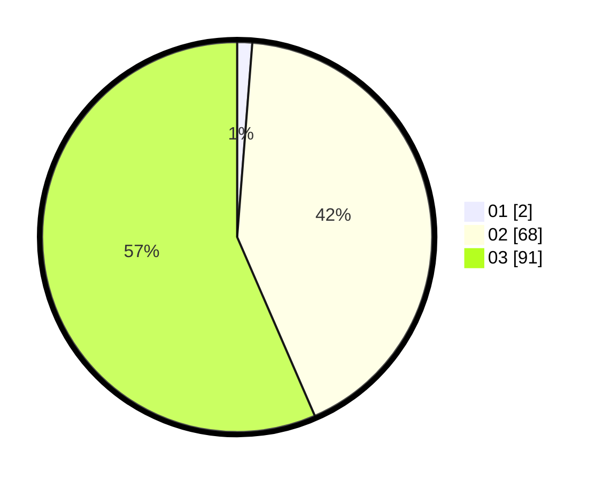

# Hasil

Hasil perolehan suara paslon dapat dilihat pada file paslon-01.txt, paslon-02.txt, dan paslon-03.txt.

Jika tidak ada, artinya data tersebut belum ada pada SIREKAP.

## Perolehan Suara

 * Paslon 01: **2**.
 * Paslon 02: **68**.
 * Paslon 03: **91**.

## Foto C Plano

https://sirekap-obj-formc.kpu.go.id/0e22/pemilu/ppwp/31/73/04/10/01/3173041001001-20240216-010531--2093e404-ae15-4e5e-9d90-a1424b34a64b.jpg

https://sirekap-obj-formc.kpu.go.id/0e22/pemilu/ppwp/31/73/04/10/01/3173041001001-20240214-190001--03ee1968-8ce1-4cbb-ac3f-2f28d926d381.jpg

https://sirekap-obj-formc.kpu.go.id/0e22/pemilu/ppwp/31/73/04/10/01/3173041001001-20240216-010533--37ac5bce-46e8-41a9-8802-f9fc02742ff6.jpg

## DATA PEMILIH TETAP

Jumlah pemilih dalam DPT: **226**.
 * L: **111**.
 * P: **115**.

## DATA PENGGUNA HAK PILIH

Jumlah pengguna hak pilih dalam DPT: **157**.
 * L: **76**.
 * P: **81**.

Jumlah pengguna hak pilih dalam DPTb: **3**.
 * L: **1**.
 * P: **2**.

Jumlah pengguna hak pilih dalam DPK: **1**.
 * L: **1**.
 * P: **0**.

Jumlah pengguna hak pilih: **161**.
 * L: **78**.
 * P: **83**.

## JUMLAH SUARA SAH DAN TIDAK SAH

JUMLAH SELURUH SUARA SAH: **161**.

JUMLAH SUARA TIDAK SAH: **0**.

JUMLAH SELURUH SUARA SAH DAN SUARA TIDAK SAH: **161**.
