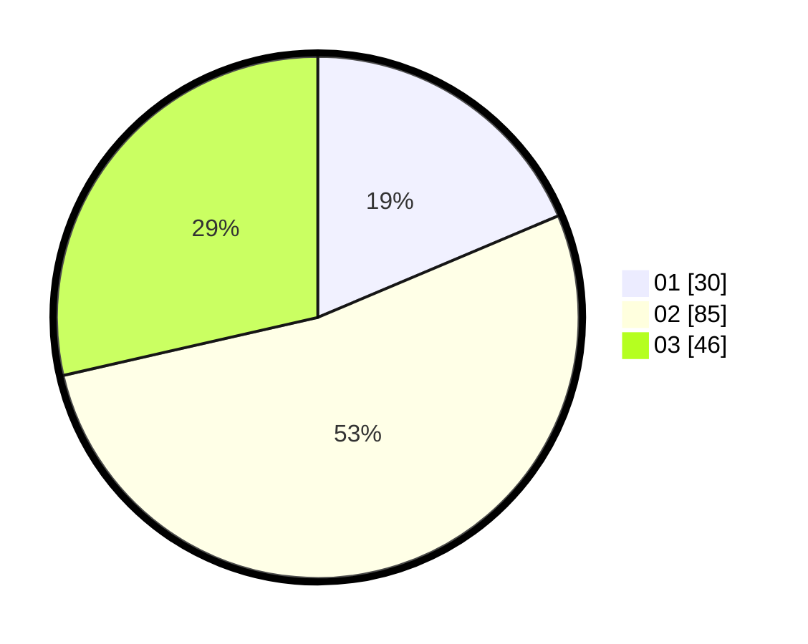

# Hasil

Hasil perolehan suara paslon dapat dilihat pada file paslon-01.txt, paslon-02.txt, dan paslon-03.txt.

Jika tidak ada, artinya data tersebut belum ada pada SIREKAP.

## Perolehan Suara

 * Paslon 01: **30**.
 * Paslon 02: **85**.
 * Paslon 03: **46**.

## Foto C Plano

https://sirekap-obj-formc.kpu.go.id/ea3e/pemilu/ppwp/31/73/04/10/01/3173041001003-20240214-185422--f8a5e948-023a-4ef9-980b-10b4e570c202.jpg

https://sirekap-obj-formc.kpu.go.id/ea3e/pemilu/ppwp/31/73/04/10/01/3173041001003-20240214-185430--b7d78e0c-b9fd-4023-ac79-5d3e6e2e0036.jpg

https://sirekap-obj-formc.kpu.go.id/ea3e/pemilu/ppwp/31/73/04/10/01/3173041001003-20240214-185437--8be1dd95-83f8-490e-babe-bc782e05d9da.jpg

## DATA PEMILIH TETAP

Jumlah pemilih dalam DPT: **246**.
 * L: **129**.
 * P: **117**.

## DATA PENGGUNA HAK PILIH

Jumlah pengguna hak pilih dalam DPT: **163**.
 * L: **86**.
 * P: **77**.

Jumlah pengguna hak pilih dalam DPTb: **1**.
 * L: **1**.
 * P: **0**.

Jumlah pengguna hak pilih dalam DPK: **5**.
 * L: **2**.
 * P: **3**.

Jumlah pengguna hak pilih: **169**.
 * L: **89**.
 * P: **80**.

## JUMLAH SUARA SAH DAN TIDAK SAH

JUMLAH SELURUH SUARA SAH: **161**.

JUMLAH SUARA TIDAK SAH: **8**.

JUMLAH SELURUH SUARA SAH DAN SUARA TIDAK SAH: **169**.
