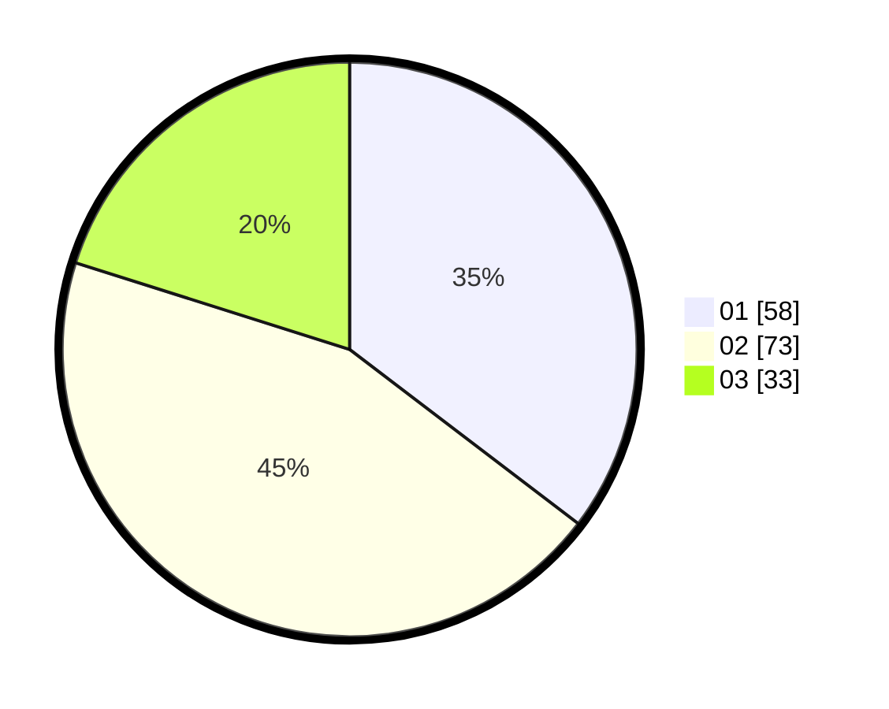

# Hasil

Hasil perolehan suara paslon dapat dilihat pada file paslon-01.txt, paslon-02.txt, dan paslon-03.txt.

Jika tidak ada, artinya data tersebut belum ada pada SIREKAP.

## Perolehan Suara

 * Paslon 01: **58**.
 * Paslon 02: **73**.
 * Paslon 03: **33**.

## Foto C Plano

https://sirekap-obj-formc.kpu.go.id/9ae5/pemilu/ppwp/31/73/04/10/01/3173041001005-20240214-155825--fb13b217-0a04-45d0-840a-3d03b41423b6.jpg

https://sirekap-obj-formc.kpu.go.id/9ae5/pemilu/ppwp/31/73/04/10/01/3173041001005-20240214-155015--2a3f2c9a-80dc-4a8f-ad79-6f805a2dac8f.jpg

https://sirekap-obj-formc.kpu.go.id/9ae5/pemilu/ppwp/31/73/04/10/01/3173041001005-20240214-155759--cb088c78-21f4-4653-821b-7e15a8a5c62f.jpg

## DATA PEMILIH TETAP

Jumlah pemilih dalam DPT: **240**.
 * L: **110**.
 * P: **130**.

## DATA PENGGUNA HAK PILIH

Jumlah pengguna hak pilih dalam DPT: **165**.
 * L: **74**.
 * P: **91**.

Jumlah pengguna hak pilih dalam DPTb: **0**.
 * L: **0**.
 * P: **0**.

Jumlah pengguna hak pilih dalam DPK: **0**.
 * L: **0**.
 * P: **0**.

Jumlah pengguna hak pilih: **165**.
 * L: **74**.
 * P: **91**.

## JUMLAH SUARA SAH DAN TIDAK SAH

JUMLAH SELURUH SUARA SAH: **164**.

JUMLAH SUARA TIDAK SAH: **1**.

JUMLAH SELURUH SUARA SAH DAN SUARA TIDAK SAH: **165**.
