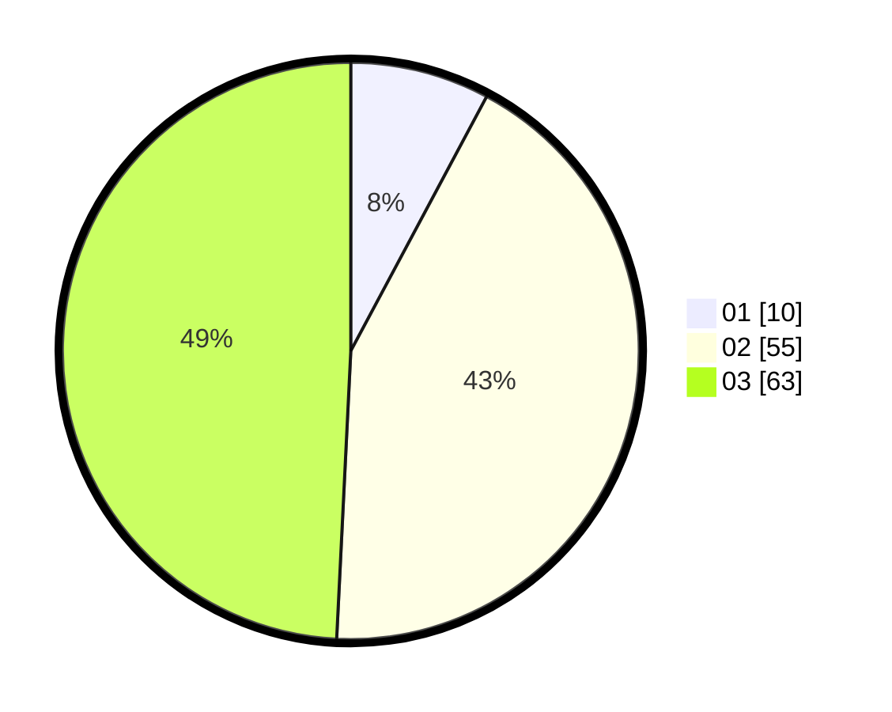

# Hasil

Hasil perolehan suara paslon dapat dilihat pada file paslon-01.txt, paslon-02.txt, dan paslon-03.txt.

Jika tidak ada, artinya data tersebut belum ada pada SIREKAP.

## Perolehan Suara

 * Paslon 01: **10**.
 * Paslon 02: **55**.
 * Paslon 03: **63**.

## Foto C Plano

https://sirekap-obj-formc.kpu.go.id/15d4/pemilu/ppwp/31/73/04/10/01/3173041001006-20240215-004236--b9b7631e-0d38-453b-8fbe-cd4974a41584.jpg

https://sirekap-obj-formc.kpu.go.id/15d4/pemilu/ppwp/31/73/04/10/01/3173041001006-20240214-185811--c82adb94-9fc5-4d2f-8cbb-cb5787e5af45.jpg

https://sirekap-obj-formc.kpu.go.id/15d4/pemilu/ppwp/31/73/04/10/01/3173041001006-20240214-194012--b8e832ac-e969-4ed2-8ad1-10e36b4b32de.jpg
