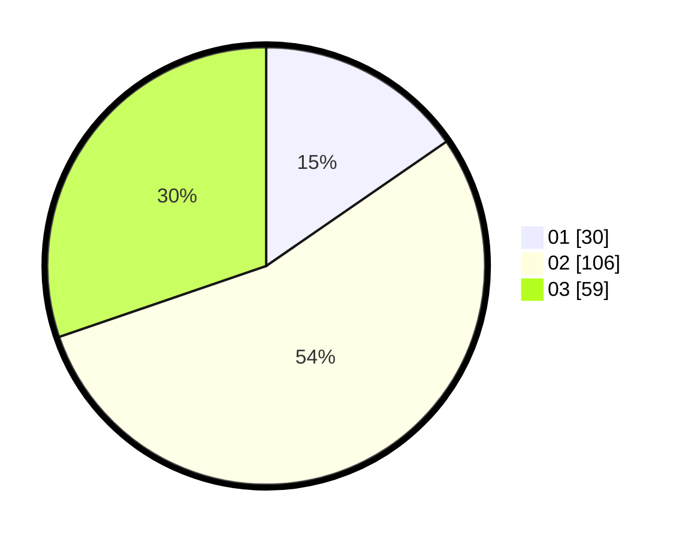

# Hasil

Hasil perolehan suara paslon dapat dilihat pada file paslon-01.txt, paslon-02.txt, dan paslon-03.txt.

Jika tidak ada, artinya data tersebut belum ada pada SIREKAP.

## Perolehan Suara

 * Paslon 01: **30**.
 * Paslon 02: **106**.
 * Paslon 03: **59**.

## Foto C Plano

https://sirekap-obj-formc.kpu.go.id/bfef/pemilu/ppwp/31/73/04/10/01/3173041001009-20240214-191449--810422ef-8b88-4357-83ff-a22dd746c78d.jpg

https://sirekap-obj-formc.kpu.go.id/bfef/pemilu/ppwp/31/73/04/10/01/3173041001009-20240214-193816--328fde46-4a49-4020-8ced-5f0532851ef1.jpg

https://sirekap-obj-formc.kpu.go.id/bfef/pemilu/ppwp/31/73/04/10/01/3173041001009-20240214-192258--3cc40f11-941f-450e-98c3-2c401fb68544.jpg

## DATA PEMILIH TETAP

Jumlah pemilih dalam DPT: **261**.
 * L: **129**.
 * P: **132**.

## DATA PENGGUNA HAK PILIH

Jumlah pengguna hak pilih dalam DPT: **192**.
 * L: **92**.
 * P: **100**.

Jumlah pengguna hak pilih dalam DPTb: **4**.
 * L: **2**.
 * P: **2**.

Jumlah pengguna hak pilih dalam DPK: **1**.
 * L: **1**.
 * P: **0**.

Jumlah pengguna hak pilih: **197**.
 * L: **95**.
 * P: **102**.

## JUMLAH SUARA SAH DAN TIDAK SAH

JUMLAH SELURUH SUARA SAH: **195**.

JUMLAH SUARA TIDAK SAH: **2**.

JUMLAH SELURUH SUARA SAH DAN SUARA TIDAK SAH: **197**.
