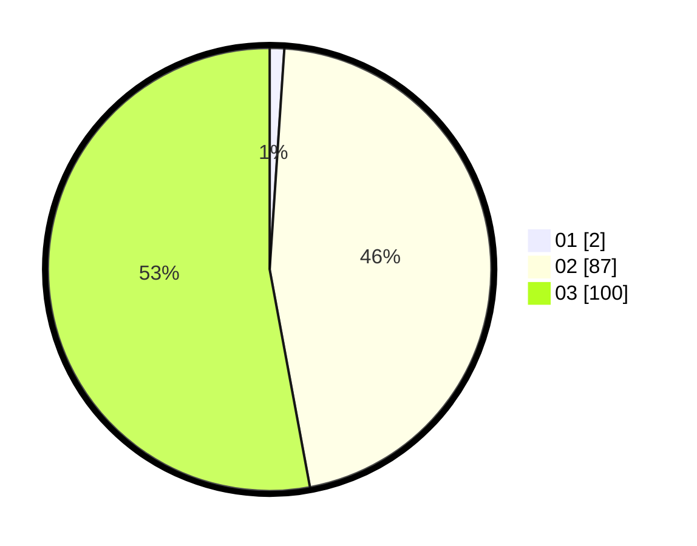

# Hasil

Hasil perolehan suara paslon dapat dilihat pada file paslon-01.txt, paslon-02.txt, dan paslon-03.txt.

Jika tidak ada, artinya data tersebut belum ada pada SIREKAP.

## Perolehan Suara

 * Paslon 01: **2**.
 * Paslon 02: **87**.
 * Paslon 03: **100**.

## Foto C Plano

https://sirekap-obj-formc.kpu.go.id/0a7a/pemilu/ppwp/31/73/04/10/01/3173041001012-20240214-190014--8ee8e89b-e032-4934-96af-4daa4f635897.jpg

https://sirekap-obj-formc.kpu.go.id/0a7a/pemilu/ppwp/31/73/04/10/01/3173041001012-20240214-191719--d992e581-48ee-4ccb-afe2-a922f32eabb3.jpg

https://sirekap-obj-formc.kpu.go.id/0a7a/pemilu/ppwp/31/73/04/10/01/3173041001012-20240214-190024--58b0938e-4b8e-4da3-b0fd-156df03b7727.jpg

## DATA PEMILIH TETAP

Jumlah pemilih dalam DPT: **278**.
 * L: **126**.
 * P: **152**.

## DATA PENGGUNA HAK PILIH

Jumlah pengguna hak pilih dalam DPT: **191**.
 * L: **83**.
 * P: **108**.

Jumlah pengguna hak pilih dalam DPTb: **0**.
 * L: **0**.
 * P: **0**.

Jumlah pengguna hak pilih dalam DPK: **1**.
 * L: **0**.
 * P: **1**.

Jumlah pengguna hak pilih: **192**.
 * L: **83**.
 * P: **109**.

## JUMLAH SUARA SAH DAN TIDAK SAH

JUMLAH SELURUH SUARA SAH: **189**.

JUMLAH SUARA TIDAK SAH: **3**.

JUMLAH SELURUH SUARA SAH DAN SUARA TIDAK SAH: **192**.
