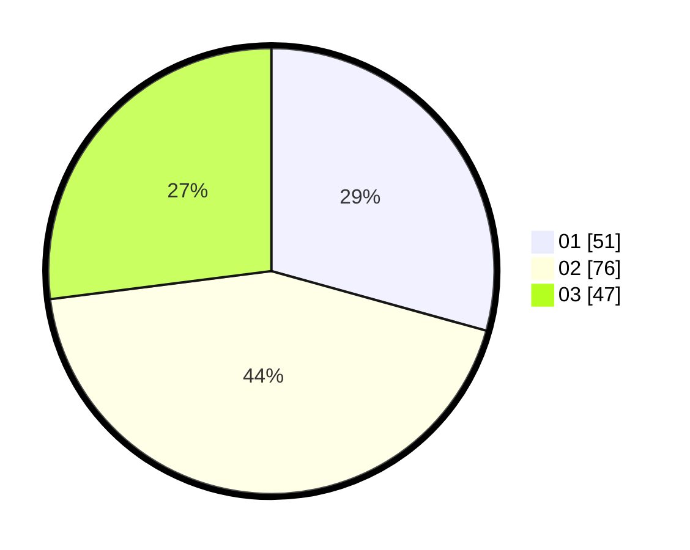

# Hasil

Hasil perolehan suara paslon dapat dilihat pada file paslon-01.txt, paslon-02.txt, dan paslon-03.txt.

Jika tidak ada, artinya data tersebut belum ada pada SIREKAP.

## Perolehan Suara

 * Paslon 01: **51**.
 * Paslon 02: **76**.
 * Paslon 03: **47**.

## Foto C Plano

https://sirekap-obj-formc.kpu.go.id/f974/pemilu/ppwp/31/73/04/10/01/3173041001013-20240214-192044--aa7c645c-6c2b-456f-807b-0dba71d7a0e3.jpg

https://sirekap-obj-formc.kpu.go.id/f974/pemilu/ppwp/31/73/04/10/01/3173041001013-20240214-200248--b4fa0483-b019-4759-978e-17e399045f6b.jpg

https://sirekap-obj-formc.kpu.go.id/f974/pemilu/ppwp/31/73/04/10/01/3173041001013-20240214-201518--f89af381-0fdb-4281-8a36-cfa6ba3dd930.jpg
