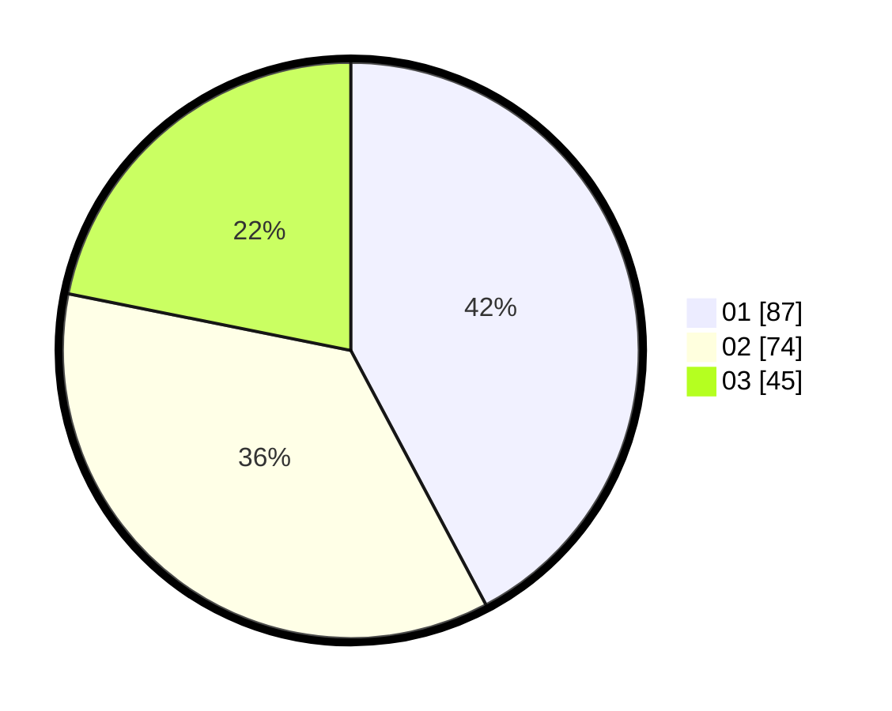

# Hasil

Hasil perolehan suara paslon dapat dilihat pada file paslon-01.txt, paslon-02.txt, dan paslon-03.txt.

Jika tidak ada, artinya data tersebut belum ada pada SIREKAP.

## Perolehan Suara

 * Paslon 01: **87**.
 * Paslon 02: **74**.
 * Paslon 03: **45**.

## Foto C Plano

https://sirekap-obj-formc.kpu.go.id/e6a4/pemilu/ppwp/31/73/04/10/01/3173041001015-20240214-195737--5fff7b46-46be-496c-88fb-c7a76160b500.jpg

https://sirekap-obj-formc.kpu.go.id/e6a4/pemilu/ppwp/31/73/04/10/01/3173041001015-20240214-195927--05953813-f13e-4190-b9ae-2359d7addf0e.jpg

https://sirekap-obj-formc.kpu.go.id/e6a4/pemilu/ppwp/31/73/04/10/01/3173041001015-20240214-215646--aeca0dc6-84e9-4abe-acb5-7a436572a9a5.jpg

## DATA PEMILIH TETAP

Jumlah pemilih dalam DPT: **222**.
 * L: **137**.
 * P: **138**.

## DATA PENGGUNA HAK PILIH

Jumlah pengguna hak pilih dalam DPT: **203**.
 * L: **443**.
 * P: **106**.

Jumlah pengguna hak pilih dalam DPTb: **554**.
 * L: **555**.
 * P: **555**.

Jumlah pengguna hak pilih dalam DPK: **521**.
 * L: **445**.
 * P: **281**.

Jumlah pengguna hak pilih: **206**.
 * L: **499**.
 * P: **107**.

## JUMLAH SUARA SAH DAN TIDAK SAH

JUMLAH SELURUH SUARA SAH: **206**.

JUMLAH SUARA TIDAK SAH: **0**.

JUMLAH SELURUH SUARA SAH DAN SUARA TIDAK SAH: **206**.
