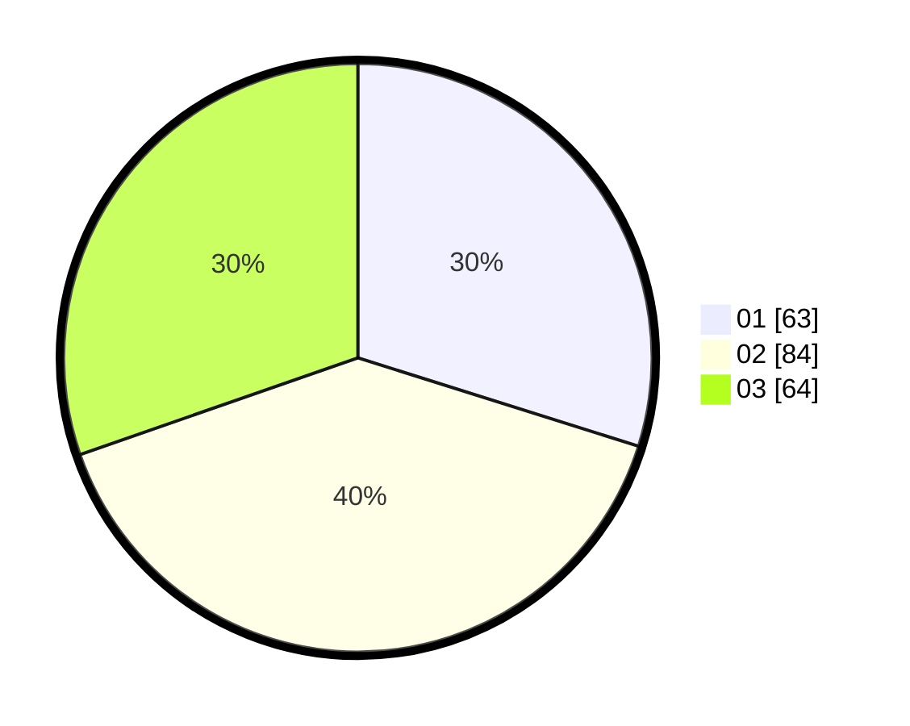

# Hasil

Hasil perolehan suara paslon dapat dilihat pada file paslon-01.txt, paslon-02.txt, dan paslon-03.txt.

Jika tidak ada, artinya data tersebut belum ada pada SIREKAP.

## Perolehan Suara

 * Paslon 01: **63**.
 * Paslon 02: **84**.
 * Paslon 03: **64**.

## Foto C Plano

https://sirekap-obj-formc.kpu.go.id/4d7c/pemilu/ppwp/31/73/04/10/01/3173041001017-20240214-214102--e7fd5eca-5ffd-47ee-8bd0-2651afae3633.jpg

https://sirekap-obj-formc.kpu.go.id/4d7c/pemilu/ppwp/31/73/04/10/01/3173041001017-20240214-214423--4cc8adf1-a70c-45d0-aa6c-c9ce3ba6c336.jpg

https://sirekap-obj-formc.kpu.go.id/4d7c/pemilu/ppwp/31/73/04/10/01/3173041001017-20240214-214533--443531f7-cb3a-41c1-9d87-d8f1a111a884.jpg

## DATA PEMILIH TETAP

Jumlah pemilih dalam DPT: **278**.
 * L: **136**.
 * P: **142**.

## DATA PENGGUNA HAK PILIH

Jumlah pengguna hak pilih dalam DPT: **210**.
 * L: **105**.
 * P: **105**.

Jumlah pengguna hak pilih dalam DPTb: **2**.
 * L: **0**.
 * P: **2**.

Jumlah pengguna hak pilih dalam DPK: **2**.
 * L: **1**.
 * P: **1**.

Jumlah pengguna hak pilih: **214**.
 * L: **106**.
 * P: **108**.

## JUMLAH SUARA SAH DAN TIDAK SAH

JUMLAH SELURUH SUARA SAH: **211**.

JUMLAH SUARA TIDAK SAH: **3**.

JUMLAH SELURUH SUARA SAH DAN SUARA TIDAK SAH: **214**.
