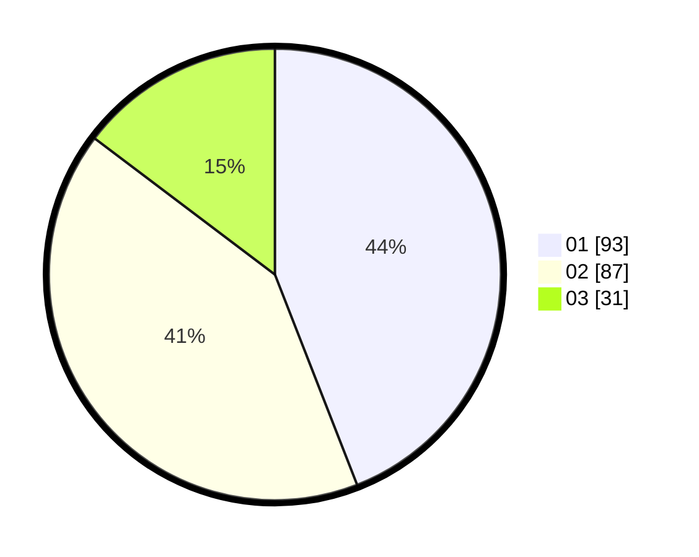

# Hasil

Hasil perolehan suara paslon dapat dilihat pada file paslon-01.txt, paslon-02.txt, dan paslon-03.txt.

Jika tidak ada, artinya data tersebut belum ada pada SIREKAP.

## Perolehan Suara

 * Paslon 01: **93**.
 * Paslon 02: **87**.
 * Paslon 03: **31**.

## Foto C Plano

https://sirekap-obj-formc.kpu.go.id/9d7f/pemilu/ppwp/31/73/04/10/01/3173041001018-20240214-200429--87d0aec3-5a73-4941-b717-2be7a5c0a08c.jpg

https://sirekap-obj-formc.kpu.go.id/9d7f/pemilu/ppwp/31/73/04/10/01/3173041001018-20240214-230010--1cc4141c-461a-4bea-822e-759f4c2b1080.jpg

https://sirekap-obj-formc.kpu.go.id/9d7f/pemilu/ppwp/31/73/04/10/01/3173041001018-20240214-230146--b7be572c-d7a9-40c7-bd18-bf612af90106.jpg
