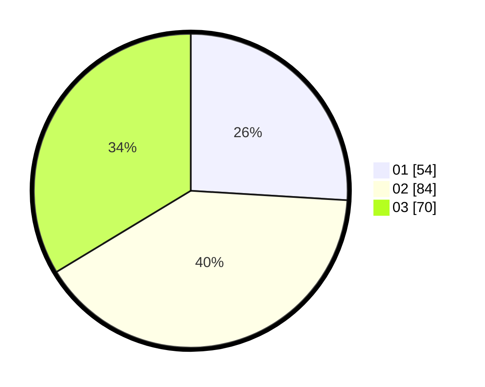

# Hasil

Hasil perolehan suara paslon dapat dilihat pada file paslon-01.txt, paslon-02.txt, dan paslon-03.txt.

Jika tidak ada, artinya data tersebut belum ada pada SIREKAP.

## Perolehan Suara

 * Paslon 01: **54**.
 * Paslon 02: **84**.
 * Paslon 03: **70**.

## Foto C Plano

https://sirekap-obj-formc.kpu.go.id/e86a/pemilu/ppwp/31/73/04/10/01/3173041001019-20240214-235624--5ff1b52c-9dc8-4188-90b3-d8bcf527967f.jpg

https://sirekap-obj-formc.kpu.go.id/e86a/pemilu/ppwp/31/73/04/10/01/3173041001019-20240215-000114--1070187a-da35-42f9-a858-241706edda84.jpg

https://sirekap-obj-formc.kpu.go.id/e86a/pemilu/ppwp/31/73/04/10/01/3173041001019-20240215-000325--5ccaa66c-70a7-421d-ab38-086e968f3158.jpg
