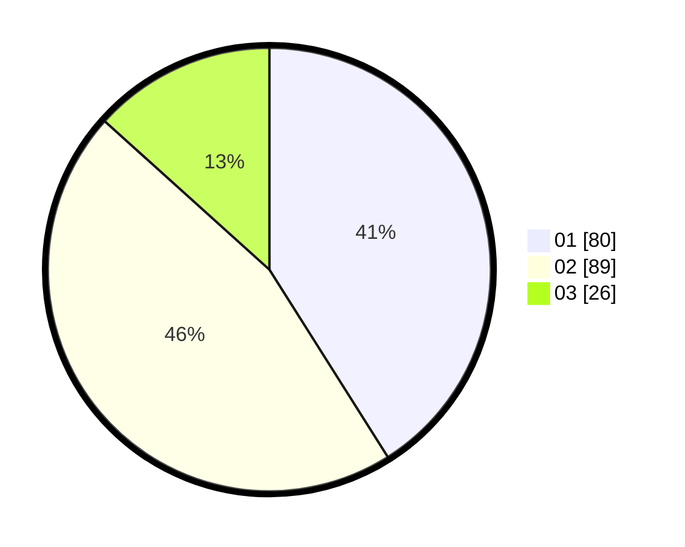

# Hasil

Hasil perolehan suara paslon dapat dilihat pada file paslon-01.txt, paslon-02.txt, dan paslon-03.txt.

Jika tidak ada, artinya data tersebut belum ada pada SIREKAP.

## Perolehan Suara

 * Paslon 01: **80**.
 * Paslon 02: **89**.
 * Paslon 03: **26**.

## Foto C Plano

https://sirekap-obj-formc.kpu.go.id/15cf/pemilu/ppwp/31/73/04/10/01/3173041001021-20240214-193241--b133005a-e1d2-493f-95d4-fbc7349c5381.jpg

https://sirekap-obj-formc.kpu.go.id/15cf/pemilu/ppwp/31/73/04/10/01/3173041001021-20240214-232020--2835d370-7e89-4dac-b073-3982240edc9b.jpg

https://sirekap-obj-formc.kpu.go.id/15cf/pemilu/ppwp/31/73/04/10/01/3173041001021-20240214-193542--9ab3a1f6-61e8-41a6-8018-5956b2c5a832.jpg

## DATA PEMILIH TETAP

Jumlah pemilih dalam DPT: **276**.
 * L: **141**.
 * P: **135**.

## DATA PENGGUNA HAK PILIH

Jumlah pengguna hak pilih dalam DPT: **195**.
 * L: **93**.
 * P: **102**.

Jumlah pengguna hak pilih dalam DPTb: **0**.
 * L: **0**.
 * P: **0**.

Jumlah pengguna hak pilih dalam DPK: **2**.
 * L: **1**.
 * P: **1**.

Jumlah pengguna hak pilih: **197**.
 * L: **94**.
 * P: **103**.

## JUMLAH SUARA SAH DAN TIDAK SAH

JUMLAH SELURUH SUARA SAH: **195**.

JUMLAH SUARA TIDAK SAH: **2**.

JUMLAH SELURUH SUARA SAH DAN SUARA TIDAK SAH: **197**.
