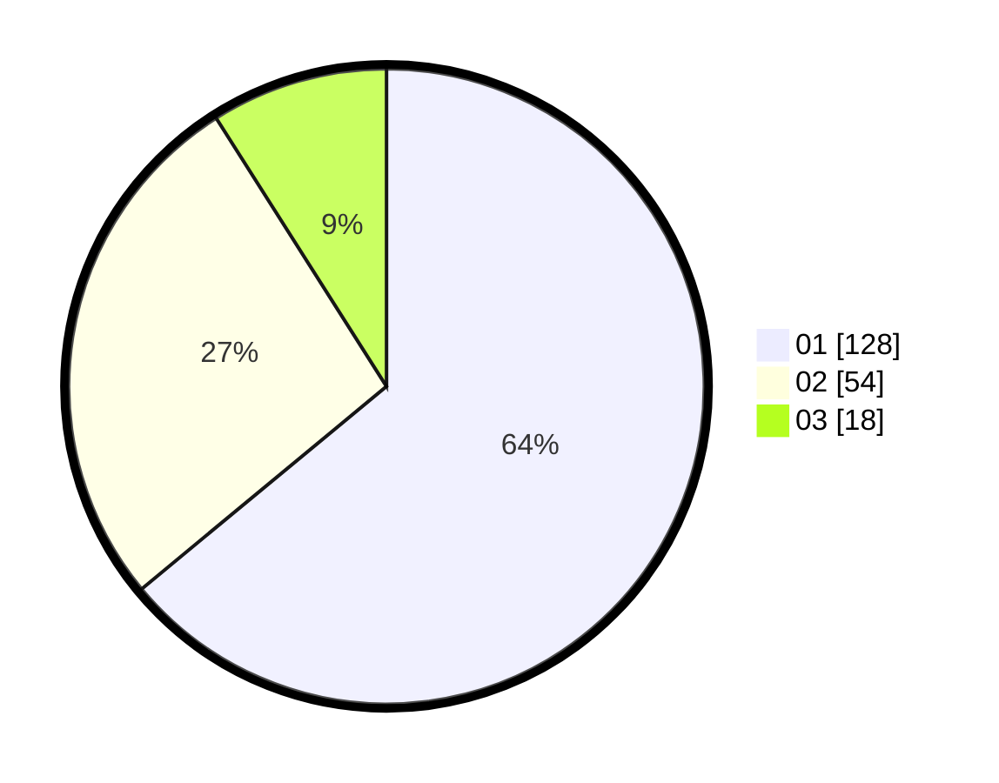

# Hasil

Hasil perolehan suara paslon dapat dilihat pada file paslon-01.txt, paslon-02.txt, dan paslon-03.txt.

Jika tidak ada, artinya data tersebut belum ada pada SIREKAP.

## Perolehan Suara

 * Paslon 01: **128**.
 * Paslon 02: **54**.
 * Paslon 03: **18**.

## Foto C Plano

https://sirekap-obj-formc.kpu.go.id/0f2e/pemilu/ppwp/31/73/04/10/01/3173041001023-20240214-155147--f621566a-1597-4eea-af79-aa28f8a5aa5c.jpg

https://sirekap-obj-formc.kpu.go.id/0f2e/pemilu/ppwp/31/73/04/10/01/3173041001023-20240214-221934--49051b63-d680-4ae3-999b-a2fa3267f064.jpg

https://sirekap-obj-formc.kpu.go.id/0f2e/pemilu/ppwp/31/73/04/10/01/3173041001023-20240214-155051--c34422ef-15e5-432d-b6f3-57554d66768e.jpg

## DATA PEMILIH TETAP

Jumlah pemilih dalam DPT: **201**.
 * L: **97**.
 * P: **104**.

## DATA PENGGUNA HAK PILIH

Jumlah pengguna hak pilih dalam DPT: **201**.
 * L: **97**.
 * P: **104**.

Jumlah pengguna hak pilih dalam DPTb: **1**.
 * L: **0**.
 * P: **1**.

Jumlah pengguna hak pilih dalam DPK: **0**.
 * L: **0**.
 * P: **0**.

Jumlah pengguna hak pilih: **202**.
 * L: **97**.
 * P: **105**.

## JUMLAH SUARA SAH DAN TIDAK SAH

JUMLAH SELURUH SUARA SAH: **200**.

JUMLAH SUARA TIDAK SAH: **2**.

JUMLAH SELURUH SUARA SAH DAN SUARA TIDAK SAH: **202**.
