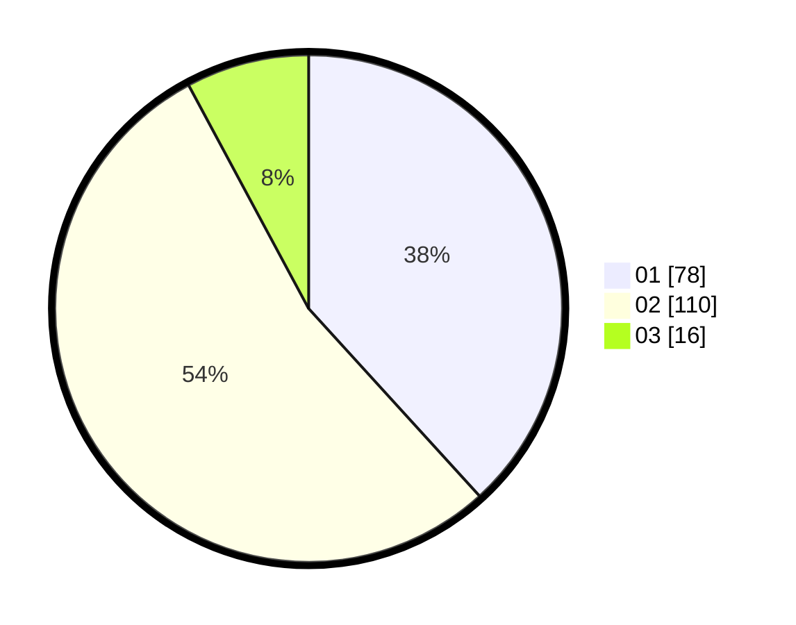

# Hasil

Hasil perolehan suara paslon dapat dilihat pada file paslon-01.txt, paslon-02.txt, dan paslon-03.txt.

Jika tidak ada, artinya data tersebut belum ada pada SIREKAP.

## Perolehan Suara

 * Paslon 01: **78**.
 * Paslon 02: **110**.
 * Paslon 03: **16**.

## Foto C Plano

https://sirekap-obj-formc.kpu.go.id/eac6/pemilu/ppwp/31/73/04/10/01/3173041001026-20240214-232719--f5ef4dfc-10c9-44d4-9ce1-75a281d1071f.jpg

https://sirekap-obj-formc.kpu.go.id/eac6/pemilu/ppwp/31/73/04/10/01/3173041001026-20240214-233528--9b1084ca-0175-475c-9be1-a925507a2028.jpg

https://sirekap-obj-formc.kpu.go.id/eac6/pemilu/ppwp/31/73/04/10/01/3173041001026-20240214-233818--e8dae275-0e5d-47cb-b733-7b2995fe4a70.jpg

## DATA PEMILIH TETAP

Jumlah pemilih dalam DPT: **251**.
 * L: **128**.
 * P: **123**.

## DATA PENGGUNA HAK PILIH

Jumlah pengguna hak pilih dalam DPT: **201**.
 * L: **102**.
 * P: **99**.

Jumlah pengguna hak pilih dalam DPTb: **3**.
 * L: **2**.
 * P: **1**.

Jumlah pengguna hak pilih dalam DPK: **2**.
 * L: **0**.
 * P: **2**.

Jumlah pengguna hak pilih: **206**.
 * L: **104**.
 * P: **102**.

## JUMLAH SUARA SAH DAN TIDAK SAH

JUMLAH SELURUH SUARA SAH: **204**.

JUMLAH SUARA TIDAK SAH: **2**.

JUMLAH SELURUH SUARA SAH DAN SUARA TIDAK SAH: **206**.
