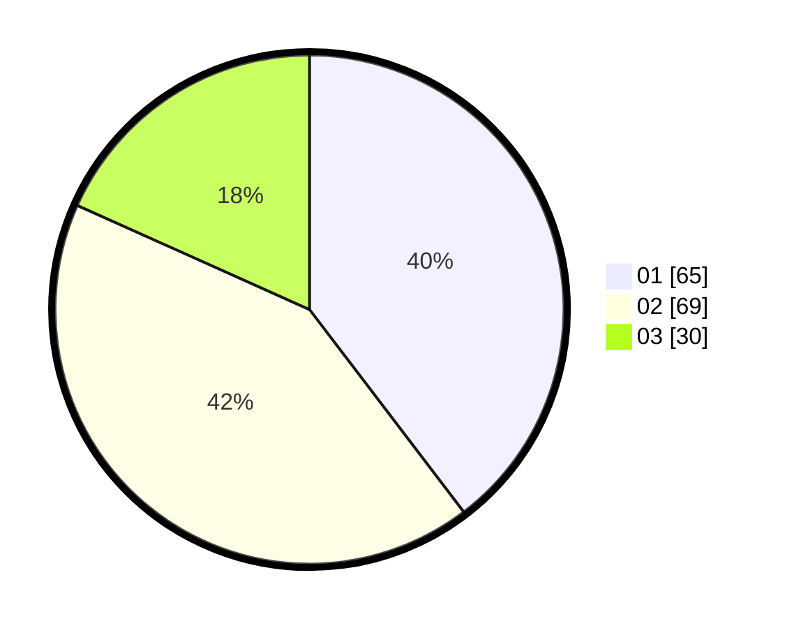

# Hasil

Hasil perolehan suara paslon dapat dilihat pada file paslon-01.txt, paslon-02.txt, dan paslon-03.txt.

Jika tidak ada, artinya data tersebut belum ada pada SIREKAP.

## Perolehan Suara

 * Paslon 01: **65**.
 * Paslon 02: **69**.
 * Paslon 03: **30**.

## Foto C Plano

https://sirekap-obj-formc.kpu.go.id/cf28/pemilu/ppwp/31/73/04/10/01/3173041001029-20240214-202527--f3b912c4-e67e-4045-98d6-9150a95aab9b.jpg

https://sirekap-obj-formc.kpu.go.id/cf28/pemilu/ppwp/31/73/04/10/01/3173041001029-20240214-202912--11d7bad2-ef4e-4d98-911b-a7fa39980efe.jpg

https://sirekap-obj-formc.kpu.go.id/cf28/pemilu/ppwp/31/73/04/10/01/3173041001029-20240214-203219--a4d48019-d600-4d2a-81f8-7392f22c10b2.jpg
