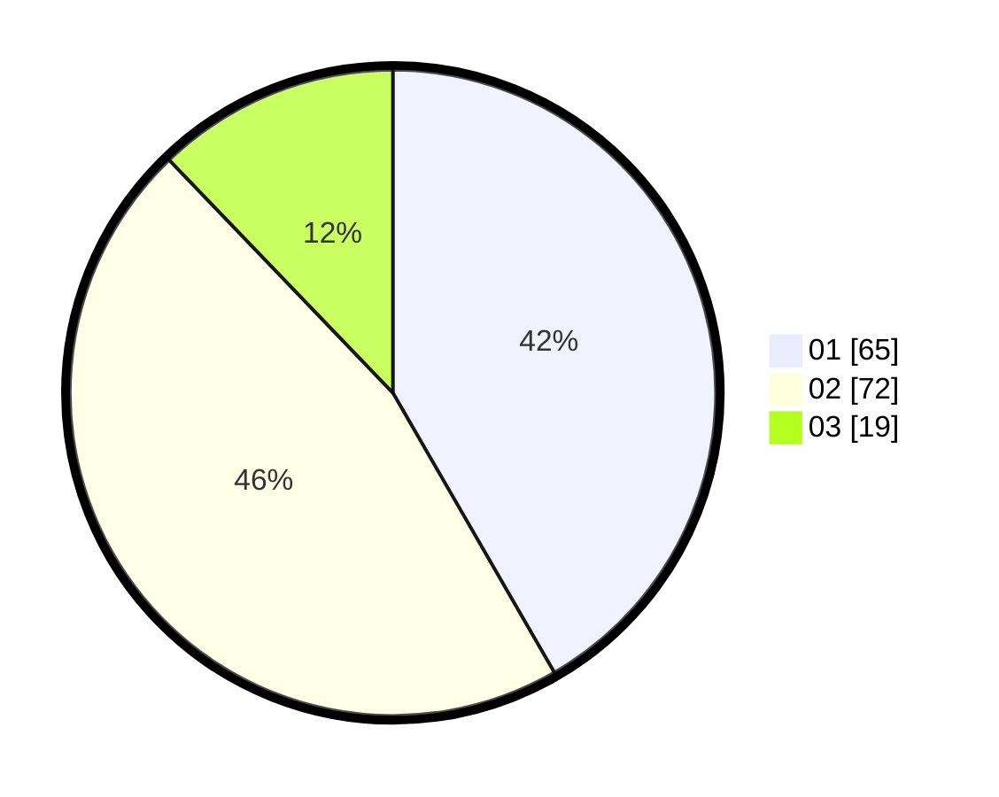

# Hasil

Hasil perolehan suara paslon dapat dilihat pada file paslon-01.txt, paslon-02.txt, dan paslon-03.txt.

Jika tidak ada, artinya data tersebut belum ada pada SIREKAP.

## Perolehan Suara

 * Paslon 01: **65**.
 * Paslon 02: **72**.
 * Paslon 03: **19**.

## Foto C Plano

https://sirekap-obj-formc.kpu.go.id/e7fb/pemilu/ppwp/31/73/04/10/01/3173041001030-20240216-142732--cf419494-1de1-448b-9ff1-58f01cdf8301.jpg

https://sirekap-obj-formc.kpu.go.id/e7fb/pemilu/ppwp/31/73/04/10/01/3173041001030-20240216-142734--69bd0033-b8f5-4517-bedb-0ea4ed540fe7.jpg

https://sirekap-obj-formc.kpu.go.id/e7fb/pemilu/ppwp/31/73/04/10/01/3173041001030-20240216-142733--d031c43a-7fcf-4404-bfee-d62f26dcaf79.jpg

## DATA PEMILIH TETAP

Jumlah pemilih dalam DPT: **203**.
 * L: **98**.
 * P: **105**.

## DATA PENGGUNA HAK PILIH

Jumlah pengguna hak pilih dalam DPT: **154**.
 * L: **81**.
 * P: **73**.

Jumlah pengguna hak pilih dalam DPTb: **2**.
 * L: **2**.
 * P: **0**.

Jumlah pengguna hak pilih dalam DPK: **0**.
 * L: **0**.
 * P: **0**.

Jumlah pengguna hak pilih: **156**.
 * L: **83**.
 * P: **73**.

## JUMLAH SUARA SAH DAN TIDAK SAH

JUMLAH SELURUH SUARA SAH: **156**.

JUMLAH SUARA TIDAK SAH: **0**.

JUMLAH SELURUH SUARA SAH DAN SUARA TIDAK SAH: **156**.
