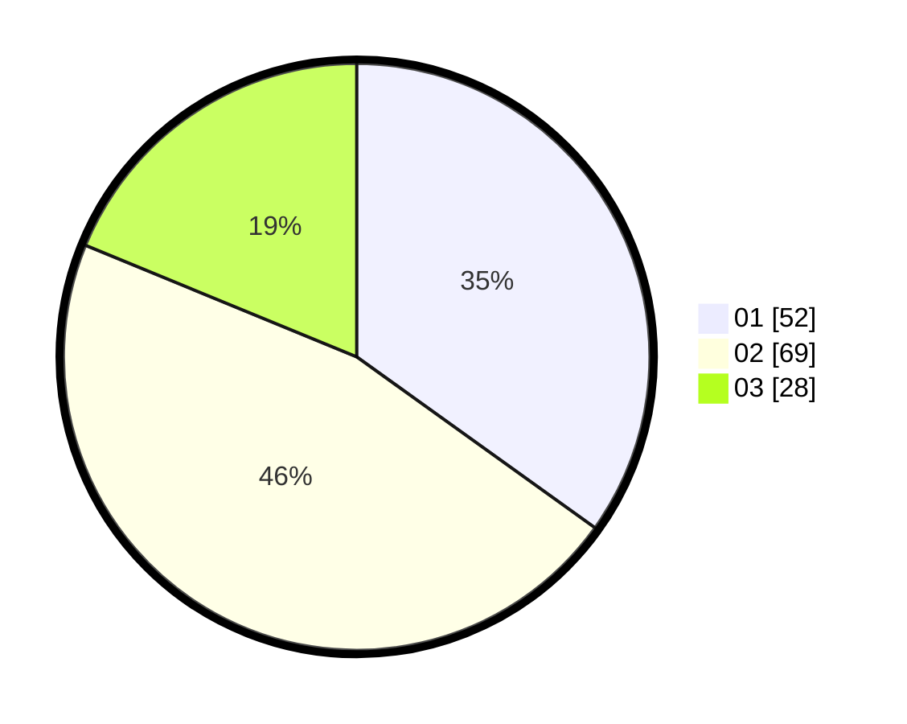

# Hasil

Hasil perolehan suara paslon dapat dilihat pada file paslon-01.txt, paslon-02.txt, dan paslon-03.txt.

Jika tidak ada, artinya data tersebut belum ada pada SIREKAP.

## Perolehan Suara

 * Paslon 01: **52**.
 * Paslon 02: **69**.
 * Paslon 03: **28**.

## Foto C Plano

https://sirekap-obj-formc.kpu.go.id/51e9/pemilu/ppwp/31/73/04/10/01/3173041001032-20240214-192307--4f39df69-7d49-445c-926e-5668ae59709f.jpg

https://sirekap-obj-formc.kpu.go.id/51e9/pemilu/ppwp/31/73/04/10/01/3173041001032-20240214-212727--e112ba02-f062-4c00-8c64-98a74185bc27.jpg

https://sirekap-obj-formc.kpu.go.id/51e9/pemilu/ppwp/31/73/04/10/01/3173041001032-20240214-213111--a01692a2-aa03-4a4f-9f66-f9dca7891927.jpg
