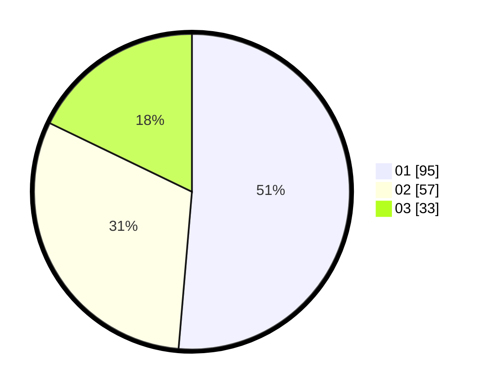

# Hasil

Hasil perolehan suara paslon dapat dilihat pada file paslon-01.txt, paslon-02.txt, dan paslon-03.txt.

Jika tidak ada, artinya data tersebut belum ada pada SIREKAP.

## Perolehan Suara

 * Paslon 01: **95**.
 * Paslon 02: **57**.
 * Paslon 03: **33**.

## Foto C Plano

https://sirekap-obj-formc.kpu.go.id/111a/pemilu/ppwp/31/73/04/10/01/3173041001034-20240215-004631--67acca7d-7f5c-4887-9c22-5ba546601f3d.jpg

https://sirekap-obj-formc.kpu.go.id/111a/pemilu/ppwp/31/73/04/10/01/3173041001034-20240215-004850--ee6dfd09-3985-44d6-86e8-7e8b9f8b5355.jpg

https://sirekap-obj-formc.kpu.go.id/111a/pemilu/ppwp/31/73/04/10/01/3173041001034-20240215-005030--3a340506-6e79-4e6f-948b-a3ebe188f65e.jpg
