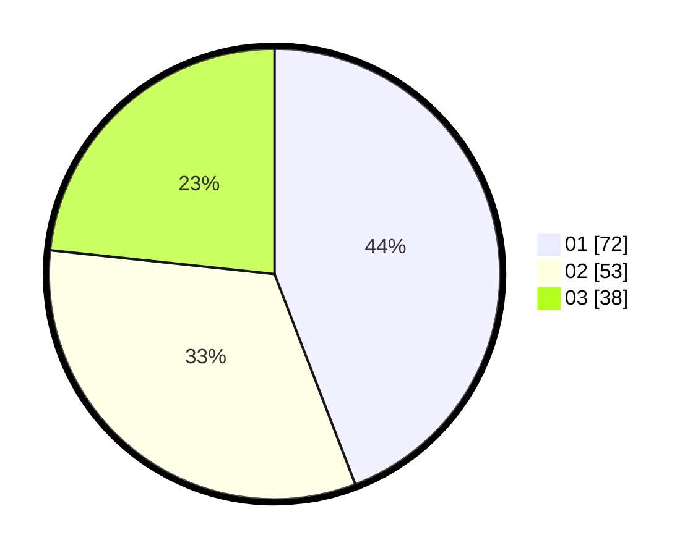

# Hasil

Hasil perolehan suara paslon dapat dilihat pada file paslon-01.txt, paslon-02.txt, dan paslon-03.txt.

Jika tidak ada, artinya data tersebut belum ada pada SIREKAP.

## Perolehan Suara

 * Paslon 01: **72**.
 * Paslon 02: **53**.
 * Paslon 03: **38**.

## Foto C Plano

https://sirekap-obj-formc.kpu.go.id/6900/pemilu/ppwp/31/73/04/10/01/3173041001035-20240214-223335--3c43a6e8-8667-47c8-bf24-340b51148834.jpg

https://sirekap-obj-formc.kpu.go.id/6900/pemilu/ppwp/31/73/04/10/01/3173041001035-20240214-225215--5adec1c7-0b10-4450-9ca5-354539fa3410.jpg
