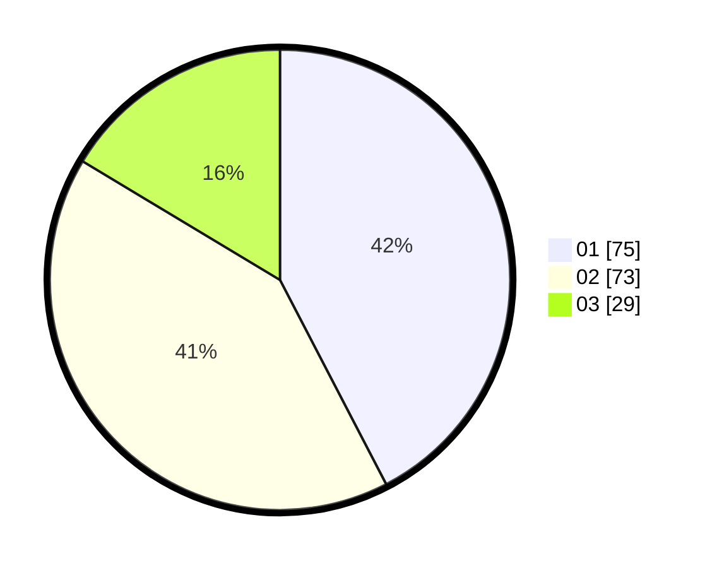

# Hasil

Hasil perolehan suara paslon dapat dilihat pada file paslon-01.txt, paslon-02.txt, dan paslon-03.txt.

Jika tidak ada, artinya data tersebut belum ada pada SIREKAP.

## Perolehan Suara

 * Paslon 01: **75**.
 * Paslon 02: **73**.
 * Paslon 03: **29**.

## Foto C Plano

https://sirekap-obj-formc.kpu.go.id/eabe/pemilu/ppwp/31/73/04/10/01/3173041001038-20240214-211308--730c689f-fe9f-4ab8-878e-adb7b9e0aeba.jpg

https://sirekap-obj-formc.kpu.go.id/eabe/pemilu/ppwp/31/73/04/10/01/3173041001038-20240214-211708--d664c9cb-823a-4d4e-a2b7-4bd392eddd58.jpg

https://sirekap-obj-formc.kpu.go.id/eabe/pemilu/ppwp/31/73/04/10/01/3173041001038-20240214-211914--94dbccc0-894b-49b3-809c-a57d9070a9ab.jpg
