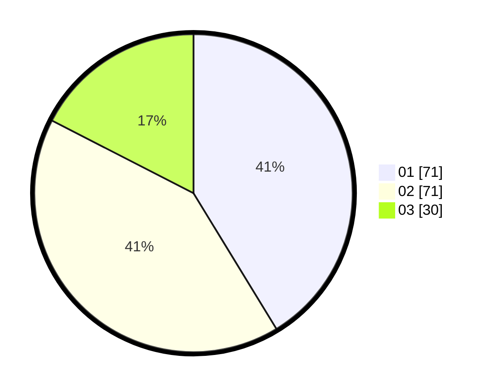

# Hasil

Hasil perolehan suara paslon dapat dilihat pada file paslon-01.txt, paslon-02.txt, dan paslon-03.txt.

Jika tidak ada, artinya data tersebut belum ada pada SIREKAP.

## Perolehan Suara

 * Paslon 01: **71**.
 * Paslon 02: **71**.
 * Paslon 03: **30**.

## Foto C Plano

https://sirekap-obj-formc.kpu.go.id/b330/pemilu/ppwp/31/73/04/10/02/3173041002001-20240214-223950--1bd6b179-5774-4e51-ba8a-e56ad7e40dac.jpg

https://sirekap-obj-formc.kpu.go.id/b330/pemilu/ppwp/31/73/04/10/02/3173041002001-20240214-213856--e4623be0-a302-4cda-8b48-ab28812e3be3.jpg

https://sirekap-obj-formc.kpu.go.id/b330/pemilu/ppwp/31/73/04/10/02/3173041002001-20240214-224955--b2167900-a8ef-419a-966d-33e45b51ff95.jpg
