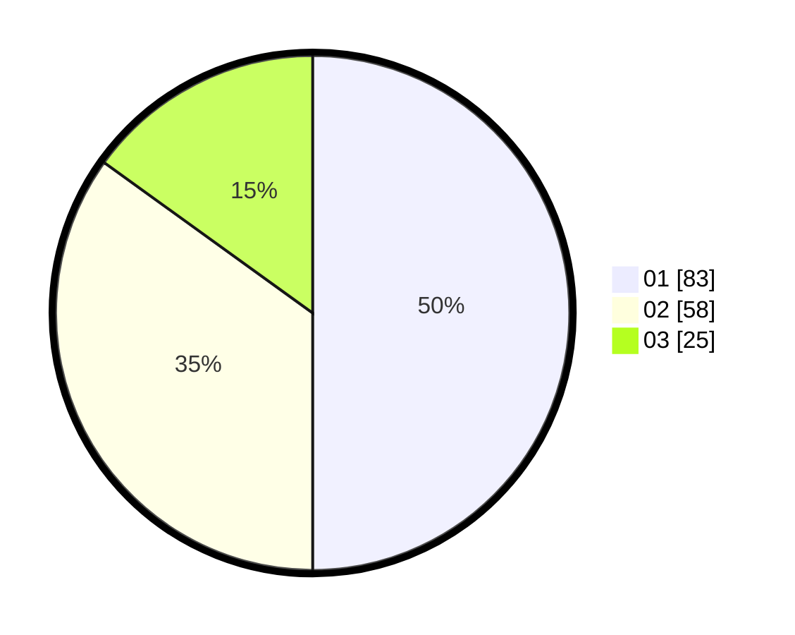

# Hasil

Hasil perolehan suara paslon dapat dilihat pada file paslon-01.txt, paslon-02.txt, dan paslon-03.txt.

Jika tidak ada, artinya data tersebut belum ada pada SIREKAP.

## Perolehan Suara

 * Paslon 01: **83**.
 * Paslon 02: **58**.
 * Paslon 03: **25**.

## Foto C Plano

https://sirekap-obj-formc.kpu.go.id/2dd6/pemilu/ppwp/31/73/04/10/02/3173041002003-20240214-195958--df219645-1759-4363-8fa9-12a054de1f70.jpg

https://sirekap-obj-formc.kpu.go.id/2dd6/pemilu/ppwp/31/73/04/10/02/3173041002003-20240214-213004--5d44da0d-d2c7-4f8b-b949-071d387172ff.jpg

https://sirekap-obj-formc.kpu.go.id/2dd6/pemilu/ppwp/31/73/04/10/02/3173041002003-20240214-211411--eee64470-0137-49f5-a9fb-b894e733841a.jpg

## DATA PEMILIH TETAP

Jumlah pemilih dalam DPT: **248**.
 * L: **123**.
 * P: **125**.

## DATA PENGGUNA HAK PILIH

Jumlah pengguna hak pilih dalam DPT: **168**.
 * L: **81**.
 * P: **87**.

Jumlah pengguna hak pilih dalam DPTb: **0**.
 * L: **0**.
 * P: **0**.

Jumlah pengguna hak pilih dalam DPK: **2**.
 * L: **0**.
 * P: **2**.

Jumlah pengguna hak pilih: **170**.
 * L: **81**.
 * P: **89**.

## JUMLAH SUARA SAH DAN TIDAK SAH

JUMLAH SELURUH SUARA SAH: **0**.

JUMLAH SUARA TIDAK SAH: **0**.

JUMLAH SELURUH SUARA SAH DAN SUARA TIDAK SAH: **0**.
