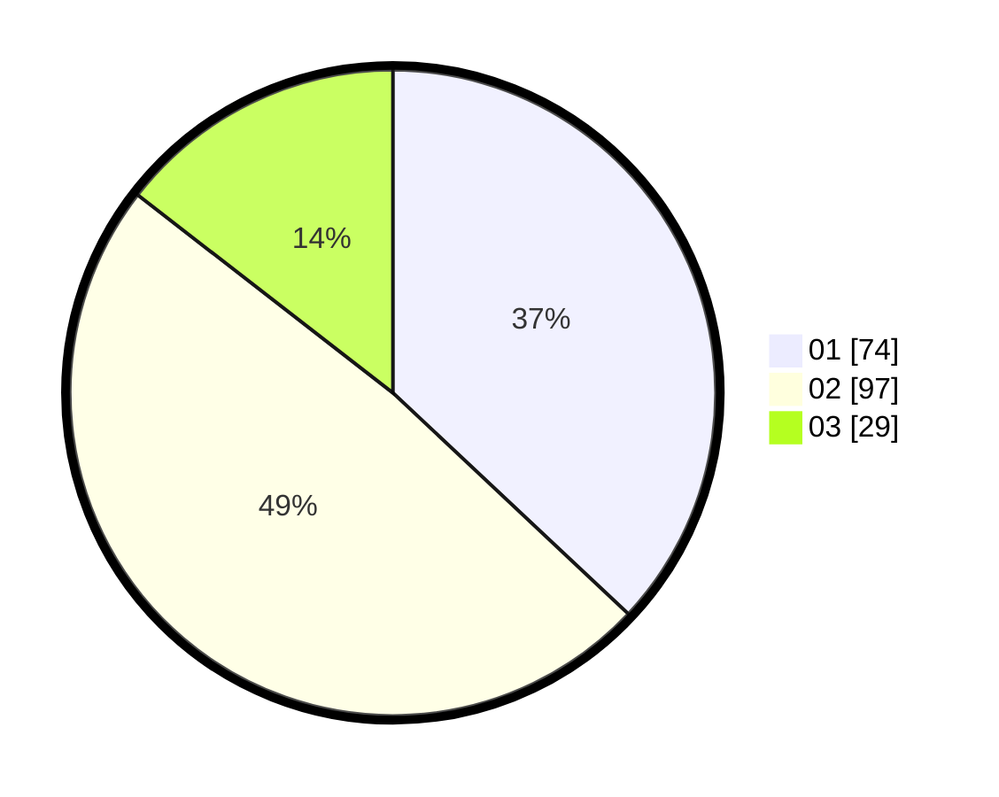

# Hasil

Hasil perolehan suara paslon dapat dilihat pada file paslon-01.txt, paslon-02.txt, dan paslon-03.txt.

Jika tidak ada, artinya data tersebut belum ada pada SIREKAP.

## Perolehan Suara

 * Paslon 01: **74**.
 * Paslon 02: **97**.
 * Paslon 03: **29**.

## Foto C Plano

https://sirekap-obj-formc.kpu.go.id/6fc5/pemilu/ppwp/31/73/04/10/02/3173041002004-20240214-195922--ff9c042c-b46d-465f-b061-fb573b9a2819.jpg

https://sirekap-obj-formc.kpu.go.id/6fc5/pemilu/ppwp/31/73/04/10/02/3173041002004-20240214-200045--a73a6087-9d95-4c75-acac-93aa97d8bd2f.jpg

https://sirekap-obj-formc.kpu.go.id/6fc5/pemilu/ppwp/31/73/04/10/02/3173041002004-20240214-200308--d43baa67-bede-4298-9360-8264ed5fdb26.jpg

## DATA PEMILIH TETAP

Jumlah pemilih dalam DPT: **272**.
 * L: **141**.
 * P: **131**.

## DATA PENGGUNA HAK PILIH

Jumlah pengguna hak pilih dalam DPT: **203**.
 * L: **100**.
 * P: **103**.

Jumlah pengguna hak pilih dalam DPTb: **0**.
 * L: **0**.
 * P: **0**.

Jumlah pengguna hak pilih dalam DPK: **3**.
 * L: **2**.
 * P: **1**.

Jumlah pengguna hak pilih: **206**.
 * L: **102**.
 * P: **104**.

## JUMLAH SUARA SAH DAN TIDAK SAH

JUMLAH SELURUH SUARA SAH: **200**.

JUMLAH SUARA TIDAK SAH: **6**.

JUMLAH SELURUH SUARA SAH DAN SUARA TIDAK SAH: **206**.
