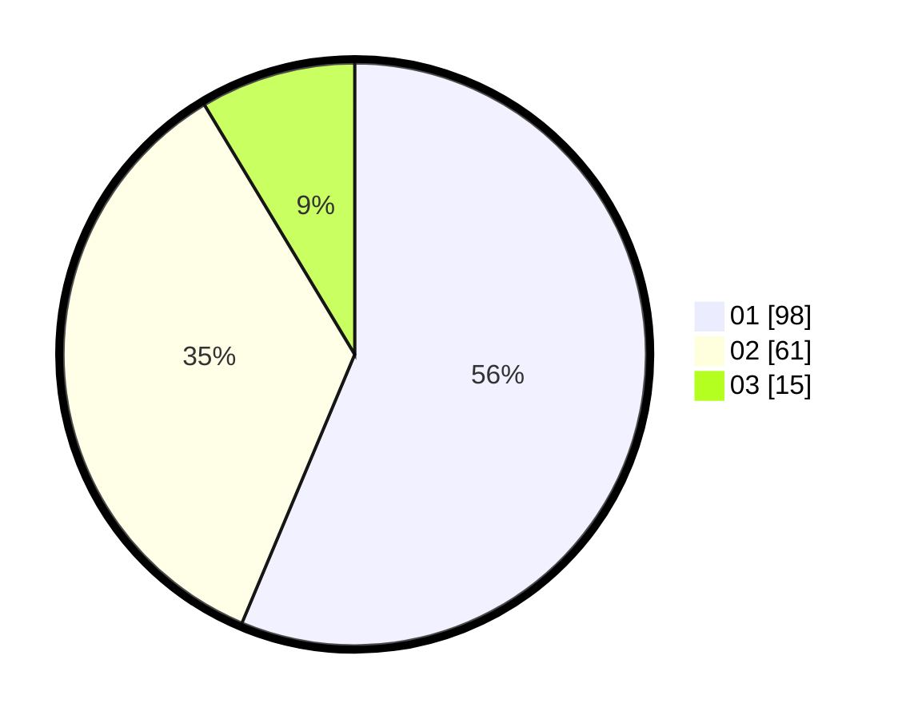

# Hasil

Hasil perolehan suara paslon dapat dilihat pada file paslon-01.txt, paslon-02.txt, dan paslon-03.txt.

Jika tidak ada, artinya data tersebut belum ada pada SIREKAP.

## Perolehan Suara

 * Paslon 01: **98**.
 * Paslon 02: **61**.
 * Paslon 03: **15**.

## Foto C Plano

https://sirekap-obj-formc.kpu.go.id/818d/pemilu/ppwp/31/73/04/10/02/3173041002007-20240214-230137--b9efd10a-be8f-40c8-9ee8-02a59869c19c.jpg

https://sirekap-obj-formc.kpu.go.id/818d/pemilu/ppwp/31/73/04/10/02/3173041002007-20240214-204937--95b65cef-df41-4df6-bb25-8129bd50c602.jpg

https://sirekap-obj-formc.kpu.go.id/818d/pemilu/ppwp/31/73/04/10/02/3173041002007-20240214-195808--3def4138-fe83-4ae6-8009-25f4099ce1ef.jpg
